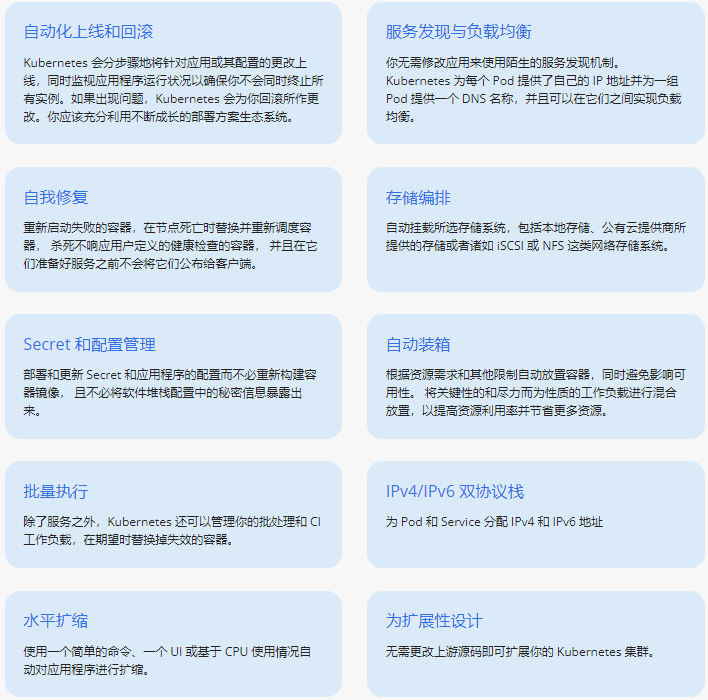
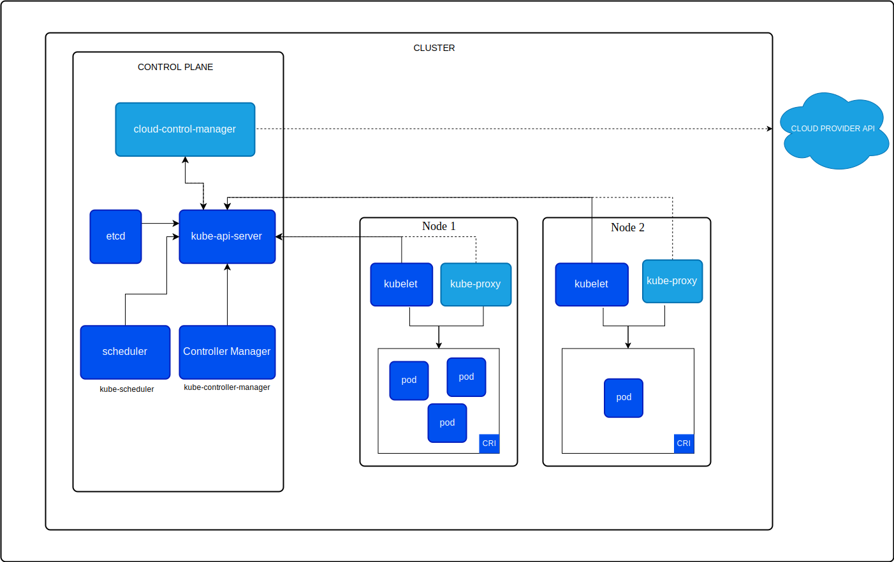

# kubernetes入门

## kubernetes介绍

Kubernetes（也称 "k8s" 或 "kube"）是一个容器编排平台，用于调度和自动部署、管理和扩展容器化应用程序。

Kubernetes 最初由谷歌开发，并在 2014 年开源发布。它是 Google 内部使用的容器编排平台 Borg 的后代。Kubernetes 在希腊语中是舵手或飞行员的意思，在 Kubernetes 徽标（链接位于 ibm.com 外部）中以船舵为象征。



## kubernetes架构

> [官网](https://kubernetes.io/zh-cn/docs/concepts/overview/components/)  `https://kubernetes.io/zh-cn/docs/concepts/overview/components/`




一个正常运行的 Kubernetes 集群由多个节点组成，这些节点包括控制平面组件(Control Plane Components)和工作节点（Worker），其中控制平面是集群的管理中心，用于管理集群中的工作节点和 Pod。 woker节点负责维护运行的 Pod 并提供 Kubernetes 运行环境。

kubelet 在生产环境中，控制平面通常跨多台计算机运行，一个集群通常运行多个节点，提供容错性和高可用性。
- **控制平面组件 Control Plane Components**
  - kube-apiserver：用于暴露 Kubernetes API 。人格得资源请求/调度等操作都是通过 kube-apiserver 提供的接口运行
  - kube-controller-manager：控制器管理器，用于对各种控制器进行控制，他们是就请你中处理常规任务得后台线程
  - kube-scheduler：监控新创建没有分配到 Worker节点的Pod，为一个Pod选择一个合适的节点运行
  - etcd： Kubernetes默认的存储系统。用于保存集群状态的所有数据
- **Worker 组件**
  - kubelet：负责维护容器的声明周期（创建、销毁 Pod），同时也负责存储卷Volumn（CVI）和网络（CNI）等信息
  - kube-proxy
    - 通过生成 iptables/ipvs 规则实现 Service 规则
    - 随时与 kube-apiserver 进行通信，将 Service 规则提交给 apiserver 保存到etcd中
  - 容器运行时（Container Runtime）
    - 负责镜像管理已经Pod中容器的真正运行
    - Kubernetes 支持许多容器运行环境，例如 containerd、 CRI-O 以及 Kubernetes CRI (容器运行环境接口) 的其他任何实现。
插件（Addons）
- **插件 Addons**
  - DNS
    - coredns： 负责为整个集群提供DNS服务
  - Web UI (Dashboard)： 提供图形化UI
  - Container Resource Monitoring: 提供集群资源监控
    - Heapster
    - Metries-server
  - Cluster-level Logging：提供日志采集、存储和检索
    - EFK
  - Network Plugins：负责为 Pod 分配 IP 地址，并使这些 Pod 能在集群内部相互通信
    - flannel
    - calico
    - canal

## Kubernetes部署

> [官网](https://kubernetes.io/zh-cn/docs/tasks/tools/) ： `https://kubernetes.io/zh-cn/docs/tasks/tools/`

### 使用Kubadm快速部署v1.21.0集群

使用 kubeadm 快速部署Kubernetes集群。操作系统为CentOS 7.6.1810 X86_64，用到的各相关程序版本如下：
- kubernetes： v1.21.0
- docker：20.10.9
- calico: 3.21

| 主机名 | IP | 配置 | 
| --- | --- | --- | 
|k8s-master-01| 192.168.122.21 | 4c8g/120G | 
|k8s-worker-01| 192.168.122.31 | 4c8g/120G |
|k8s-worker-02| 192.168.122.32 | 4c8g/120G |
|k8s-worker-03| 192.168.122.33 | 4c8g/120G |


#### 准备环境

1. 主机名hosts文件解析
``` 
cat  >> /etc/hosts <<EOF
192.168.122.21 k8s-master-01 
192.168.122.31 k8s-worker-01 
192.168.122.32 k8s-worker-02
192.168.122.33 k8s-worker-03
# 此IP用于后期扩展多master使用
192.168.122.21 kube-vip 
EOF
```

2.主机安全设置
```
# 关闭防火墙
systemctl  stop firewalld && systemctl  disable firewalld

# 关闭selinux
sed -i 's@SELINUX=enforcing@SELINUX=disabled@g' /etc/selinux/config && setenforce 0

# 关闭swap分区
swapoff -a  
sed -ri 's/.*swap.*/#&/' /etc/fstab

# 时间同步
crontab  -e
*/3 * * * * /usr/sbin/ntpdate time1.aliyun.com &> /dev/null
```

3. 升级系统内核
``` 
# 载入公钥
rpm --import https://www.elrepo.org/RPM-GPG-KEY-elrepo.org
# 安装ELRepo
rpm -Uvh http://www.elrepo.org/elrepo-release-7.0-3.el7.elrepo.noarch.rpm
# 载入elrepo-kernel元数据
yum --disablerepo=\* --enablerepo=elrepo-kernel repolist
# 查看可用的rpm包
yum --disablerepo=\* --enablerepo=elrepo-kernel list kernel*

# 安装长期稳定版本的kernel
yum --disablerepo=\* --enablerepo=elrepo-kernel install -y kernel-ml.x86_64
# 删除旧版本工具包
yum remove kernel-tools-libs.x86_64 kernel-tools.x86_64 -y
# 安装新版本工具包
yum --disablerepo=\* --enablerepo=elrepo-kernel install -y kernel-ml-tools.x86_64

#查看默认启动顺序
awk -F\' '$1=="menuentry " {print $2}' /etc/grub2.cfg  
CentOS Linux (6.8.9-1.el7.elrepo.x86_64) 7 (Core)
CentOS Linux (3.10.0-957.el7.x86_64) 7 (Core)
CentOS Linux (0-rescue-bfcfb6d73a48470c9919e1a3ded47429) 7 (Core)
#默认启动的顺序是从0开始，新内核是从头插入（目前位置在0，而4.4.4的是在1），所以需要选择0。
grub2-set-default 0  
# 重新生成grub2引导文件
grub2-mkconfig -o /boot/grub2/grub.cfg
#重启并检查， 也可以后面配置完在重启
reboot
```

4. 配置内核转发以网桥过滤
```
# 添加内核配置
cat > /etc/sysctl.d/k8s.conf <<EOF
net.bridge.bridge-nf-call-ip6tables = 1
net.bridge.bridge-nf-call-iptables = 1
net.ipv4.ip_forward = 1
vm.swappiness = 0
EOF

sysctl -p  /etc/sysctl.d/k8s.conf

# 加载 br_netfilter 模块
modprobe  br_netfilter

# 检查
lsmod |grep  br_netfilter
br_netfilter           22256  0 
bridge                155432  1 br_netfilter
```

5. 安装 ipset 和 ipvsadm
``` 
yum install ipvsadm ipset -y
```
6. 配置ipvsadm 模块加载
```
cat > /etc/sysconfig/modules/ipvs.modules << EOF
modprobe ip_vs
modprobe ip_vs_rr
modprobe ip_vs_wrr
modprobe ip_vs_sh
modprobe nf_conntrack
EOF

chmod 755  /etc/sysconfig/modules/ipvs.modules && bash /etc/sysconfig/modules/ipvs.modules

# 验证
lsmod | grep -e "ip_vs"             
ip_vs_sh               12288  0 
ip_vs_wrr              12288  0 
ip_vs_rr               12288  0 
ip_vs                 200704  6 ip_vs_rr,ip_vs_sh,ip_vs_wrr
nf_conntrack          188416  1 ip_vs
nf_defrag_ipv6         24576  2 nf_conntrack,ip_vs
libcrc32c              12288  3 nf_conntrack,xfs,ip_vs

# 重启系统
reboot
```

#### 安装容器运行时

1. 安装docker
```
# 安装必要的一些系统工具
yum install -y yum-utils device-mapper-persistent-data lvm2
# 添加软件源信息
yum-config-manager --add-repo https://mirrors.aliyun.com/docker-ce/linux/centos/docker-ce.repo
# Step 3
sed -i 's+download.docker.com+mirrors.aliyun.com/docker-ce+' /etc/yum.repos.d/docker-ce.repo
# 更新并安装Docker-CE
yum makecache fast
yum list docker-ce.x86_64 --showduplicates | sort -r

# 安装指定版本的docker
yum install -y docker-ce-20.10.9

systemctl enable docker --now
```

2. 配置docker加速器和cgroup方式
``` 
cat > /etc/docker/daemon.json <<EOF
{
    "registry-mirrors": ["https://o4uba187.mirror.aliyuncs.com"],
    "exec-opts": ["native.cgroupdriver=systemd"]
}
EOF

systemctl daemon-reload && systemctl restart docker
```

#### 安装kubernetes集群

1. 配置kubernetes源
``` 
cat <<EOF > /etc/yum.repos.d/kubernetes.repo
[kubernetes]
name=Kubernetes
baseurl=https://mirrors.aliyun.com/kubernetes/yum/repos/kubernetes-el7-x86_64/
enabled=1
gpgcheck=1
repo_gpgcheck=1
gpgkey=https://mirrors.aliyun.com/kubernetes/yum/doc/yum-key.gpg https://mirrors.aliyun.com/kubernetes/yum/doc/rpm-package-key.gpg
EOF
```

2. 安装软件包
```
yum install kubeadm-1.21.0 kubelet-1.21.0 kubectl-1.21.0 -y     
```

3. 配置kubelet
``` 
cat >  cat /etc/sysconfig/kubelet <<EOF
KUBELET_EXTRA_ARGS="--cgroup-driver=systemd"
EOF

systemctl  enable kubelet 
```

4. 集群初始化
```
# 在 k8s-master-01上执行初始化
kubeadm init --kubernetes-version=v1.21.0 \
   --apiserver-advertise-address=192.168.122.21 \
   --control-plane-endpoint=k8s-vip \
   --pod-network-cidr=10.244.0.0/16   \
   --service-cidr=10.96.0.0/12 \
   --image-repository=registry.cn-hangzhou.aliyuncs.com/google_containers | tee kubeadm-init.log

Your Kubernetes control-plane has initialized successfully!

To start using your cluster, you need to run the following as a regular user:

  mkdir -p $HOME/.kube
  sudo cp -i /etc/kubernetes/admin.conf $HOME/.kube/config
  sudo chown $(id -u):$(id -g) $HOME/.kube/config

Alternatively, if you are the root user, you can run:

  export KUBECONFIG=/etc/kubernetes/admin.conf

You should now deploy a pod network to the cluster.
Run "kubectl apply -f [podnetwork].yaml" with one of the options listed at:
  https://kubernetes.io/docs/concepts/cluster-administration/addons/

You can now join any number of control-plane nodes by copying certificate authorities
and service account keys on each node and then running the following as root:

  kubeadm join kube-vip:6443 --token ztt1w5.uvhguz3a3exepasv \
        --discovery-token-ca-cert-hash sha256:a991b8eaa0c558a7ae22f5afd746d554ca13837435d4d866159407d8b0ed54e7 \
        --control-plane 

Then you can join any number of worker nodes by running the following on each as root:

kubeadm join kube-vip:6443 --token ztt1w5.uvhguz3a3exepasv \
        --discovery-token-ca-cert-hash sha256:a991b8eaa0c558a7ae22f5afd746d554ca13837435d4d866159407d8b0ed54e7 
```
> 报错：`[ERROR ImagePull]: failed to pull image registry.aliyuncs.com/google_containers/coredns/coredns:v1.8.0: output: Error response from daemon: pull access denied for registry.aliyuncs.com/google_containers/coredns/coredns,`

> 解决办法：
```
docker pull registry.aliyuncs.com/google_containers/coredns:v1.8.0 &&
docker tag registry.aliyuncs.com/google_containers/coredns:v1.8.0 registry.aliyuncs.com/google_containers/coredns/coredns:v1.8.0 
```
7. 配置kubeclt 客户端
``` 
mkdir -p $HOME/.kube
sudo cp -i /etc/kubernetes/admin.conf $HOME/.kube/config
sudo chown $(id -u):$(id -g) $HOME/.kube/config
```

8. 添加 worker 节点
``` 
kubeadm join kube-vip:6443 --token ztt1w5.uvhguz3a3exepasv \
        --discovery-token-ca-cert-hash sha256:a991b8eaa0c558a7ae22f5afd746d554ca13837435d4d866159407d8b0ed54e7 
# 
kubectl  get nodes
NAME            STATUS     ROLES                  AGE     VERSION
k8s-master-01   NotReady   control-plane,master   4m53s   v1.21.0
k8s-worker-01   NotReady   <none>                 3m2s    v1.21.0
k8s-worker-02   NotReady   <none>                 3m4s    v1.21.0
k8s-worker-03   NotReady   <none>                 3m9s    v1.21.0
```

9. 安装网络插件-[calico](https://docs.tigera.io/archive/v3.21/getting-started/kubernetes/quickstart)
```
# 安装calico
kubectl create -f https://docs.projectcalico.org/archive/v3.21/manifests/tigera-operator.yaml
wget https://docs.projectcalico.org/archive/v3.21/manifests/custom-resources.yaml
sed -i 's@cidr: 192.168.0.0/16@cidr: 10.244.0.0/16@g' custom-resources.yaml                                                     
kubectl  apply -f custom-resources.yaml


# 安装calictl命令
curl -L https://github.com/projectcalico/calicoctl/releases/download/v3.21.6/calicoctl-linux-amd64 -o calicoctl
chmod  +x ./calicoctl 
mv ./calicoctl  /usr/bin/

# 验证
kubectl  get nodes
NAME            STATUS   ROLES                  AGE   VERSION
k8s-master-01   Ready    control-plane,master   26m   v1.21.0
k8s-worker-01   Ready    <none>                 24m   v1.21.0
k8s-worker-02   Ready    <none>                 24m   v1.21.0
k8s-worker-03   Ready    <none>                 24m   v1.21.0
```

10. 集群可用性验证
``` 
kubectl create deployment myapp --image=ikubernetes/myapp:v1 --replicas=4
```


