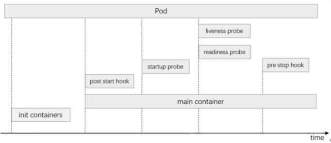

# kubernetes入门

## kubernetes介绍

Kubernetes（也称 "k8s" 或 "kube"）是一个容器编排平台，用于调度和自动部署、管理和扩展容器化应用程序。

Kubernetes 最初由谷歌开发，并在 2014 年开源发布。它是 Google 内部使用的容器编排平台 Borg 的后代。Kubernetes 在希腊语中是舵手或飞行员的意思，在 Kubernetes 徽标（链接位于 ibm.com 外部）中以船舵为象征。


## kubernetes架构

> [官网](https://kubernetes.io/zh-cn/docs/concepts/overview/components/)  `https://kubernetes.io/zh-cn/docs/concepts/overview/components/`


一个正常运行的 Kubernetes 集群由多个节点组成，这些节点包括控制平面组件(Control Plane Components)和工作节点（Worker），其中控制平面是集群的管理中心，用于管理集群中的工作节点和 Pod。 woker节点负责维护运行的 Pod 并提供 Kubernetes 运行环境。

kubelet 在生产环境中，控制平面通常跨多台计算机运行，一个集群通常运行多个节点，提供容错性和高可用性。
- **控制平面组件 Control Plane Components**
  - kube-apiserver：用于暴露 Kubernetes API 。人格得资源请求/调度等操作都是通过 kube-apiserver 提供的接口运行
  - kube-controller-manager：控制器管理器，用于对各种控制器进行控制，他们是就请你中处理常规任务得后台线程
  - kube-scheduler：监控新创建没有分配到 Worker节点的Pod，为一个Pod选择一个合适的节点运行
  - etcd： Kubernetes默认的存储系统。用于保存集群状态的所有数据
- **Worker 组件**
  - kubelet：负责维护容器的声明周期（创建、销毁 Pod），同时也负责存储卷Volumn（CVI）和网络（CNI）等信息
  - kube-proxy
    - 通过生成 iptables/ipvs 规则实现 Service 规则
    - 随时与 kube-apiserver 进行通信，将 Service 规则提交给 apiserver 保存到etcd中
  - 容器运行时（Container Runtime）
    - 负责镜像管理已经Pod中容器的真正运行
    - Kubernetes 支持许多容器运行环境，例如 containerd、 CRI-O 以及 Kubernetes CRI (容器运行环境接口) 的其他任何实现。
插件（Addons）
- **插件 Addons**
  - DNS
    - coredns： 负责为整个集群提供DNS服务
  - Web UI (Dashboard)： 提供图形化UI
  - Container Resource Monitoring: 提供集群资源监控
    - Heapster
    - Metries-server
  - Cluster-level Logging：提供日志采集、存储和检索
    - EFK
  - Network Plugins：负责为 Pod 分配 IP 地址，并使这些 Pod 能在集群内部相互通信
    - flannel
    - calico
    - canal

## Kubernetes部署

> [官网](https://kubernetes.io/zh-cn/docs/tasks/tools/) ： `https://kubernetes.io/zh-cn/docs/tasks/tools/`

### 使用Kubadm快速部署v1.22.6集群

使用 kubeadm 快速部署Kubernetes集群。操作系统为CentOS 7.6.1810 X86_64，用到的各相关程序版本如下：
- kubernetes： v1.22.6
- docker：20.10.9
- calico: 3.21

| 主机名 | IP | 配置 | 
| --- | --- | --- | 
|k8s-master-01| 192.168.122.21 | 4c8g/120G | 
|k8s-worker-01| 192.168.122.31 | 4c8g/120G |
|k8s-worker-02| 192.168.122.32 | 4c8g/120G |
|k8s-worker-03| 192.168.122.33 | 4c8g/120G |


#### 准备环境

1.主机名hosts文件解析
``` 
cat  >> /etc/hosts <<EOF
192.168.122.21 k8s-master-01 
192.168.122.31 k8s-worker-01 
192.168.122.32 k8s-worker-02
192.168.122.33 k8s-worker-03
# 用来扩展集群为高可用集群
192.168.122.21 kubeadm-vip.linux.io
EOF
```

2.主机安全设置
```
# 关闭防火墙
systemctl  stop firewalld && systemctl  disable firewalld

# 关闭selinux
sed -i 's@SELINUX=enforcing@SELINUX=disabled@g' /etc/selinux/config && setenforce 0

# 关闭swap分区
swapoff -a  
sed -ri 's/.*swap.*/#&/' /etc/fstab

# 时间同步
crontab  -e
*/3 * * * * /usr/sbin/ntpdate time1.aliyun.com &> /dev/null
```

3.升级系统内核
``` 
# 载入公钥
rpm --import https://www.elrepo.org/RPM-GPG-KEY-elrepo.org
# 安装ELRepo
rpm -Uvh http://www.elrepo.org/elrepo-release-7.0-3.el7.elrepo.noarch.rpm
# 载入elrepo-kernel元数据
yum --disablerepo=\* --enablerepo=elrepo-kernel repolist
# 查看可用的rpm包
yum --disablerepo=\* --enablerepo=elrepo-kernel list kernel*

# 安装长期稳定版本的kernel
yum --disablerepo=\* --enablerepo=elrepo-kernel install -y kernel-lt.x86_64
# 删除旧版本工具包
yum remove kernel-tools-libs.x86_64 kernel-tools.x86_64 -y
# 安装新版本工具包
yum --disablerepo=\* --enablerepo=elrepo-kernel install -y kernel-lt-tools.x86_64

#查看默认启动顺序
awk -F\' '$1=="menuentry " {print $2}' /etc/grub2.cfg  
CentOS Linux (5.4.275-1.el7.elrepo.x86_64) 7 (Core)
CentOS Linux (3.10.0-1160.71.1.el7.x86_64) 7 (Core)
CentOS Linux (0-rescue-fe1fcab895344bfebaa751220353344b) 7 (Core)
#默认启动的顺序是从0开始，新内核是从头插入（目前位置在0，而4.4.4的是在1），所以需要选择0。
grub2-set-default 0  
# 重新生成grub2引导文件
grub2-mkconfig -o /boot/grub2/grub.cfg
#重启并检查， 也可以后面配置完在重启
reboot
```

4.配置内核转发以网桥过滤
```
# 添加内核配置
cat > /etc/sysctl.d/k8s.conf <<EOF
net.bridge.bridge-nf-call-iptables = 1
net.ipv4.ip_forward = 1
net.bridge.bridge-nf-call-ip6tables = 1
user.max_user_namespaces=28633
vm.swappiness=0
EOF

sysctl  --system

# 加载 br_netfilter 模块
modprobe  br_netfilter

# 检查
lsmod |grep  br_netfilter
br_netfilter           22256  0 
bridge                155432  1 br_netfilter
```

5.安装 ipset 和 ipvsadm
``` 
yum install ipvsadm ipset -y
```
6.配置ipvsadm 模块加载
```
cat > /etc/sysconfig/modules/ipvs.modules << EOF
modprobe ip_vs
modprobe ip_vs_rr
modprobe ip_vs_wrr
modprobe ip_vs_sh
modprobe nf_conntrack
EOF

chmod 755  /etc/sysconfig/modules/ipvs.modules && bash /etc/sysconfig/modules/ipvs.modules

# 验证
lsmod | grep -e "ip_vs"             
ip_vs_sh               12288  0 
ip_vs_wrr              12288  0 
ip_vs_rr               12288  0 
ip_vs                 200704  6 ip_vs_rr,ip_vs_sh,ip_vs_wrr
nf_conntrack          188416  1 ip_vs
nf_defrag_ipv6         24576  2 nf_conntrack,ip_vs
libcrc32c              12288  3 nf_conntrack,xfs,ip_vs

# 重启系统
reboot
```

#### 安装容器运行时

1.安装docker
```
# 安装必要的一些系统工具
yum install -y yum-utils device-mapper-persistent-data lvm2
# 添加软件源信息
yum-config-manager --add-repo https://mirrors.aliyun.com/docker-ce/linux/centos/docker-ce.repo
# Step 3
sed -i 's+download.docker.com+mirrors.aliyun.com/docker-ce+' /etc/yum.repos.d/docker-ce.repo
# 更新并安装Docker-CE
yum makecache fast
yum list docker-ce.x86_64 --showduplicates | sort -r

# 安装指定版本的docker
yum install -y docker-ce-20.10.9

systemctl enable docker --now
```

2.配置docker加速器和cgroup方式
``` 
cat > /etc/docker/daemon.json <<EOF
{
    "registry-mirrors": ["https://o4uba187.mirror.aliyuncs.com"],
    "exec-opts": ["native.cgroupdriver=systemd"]
}
EOF

systemctl daemon-reload && systemctl restart docker
```

#### 安装kubernetes集群

1.配置kubernetes源
``` 
cat <<EOF > /etc/yum.repos.d/kubernetes.repo
[kubernetes]
name=Kubernetes
baseurl=https://mirrors.aliyun.com/kubernetes/yum/repos/kubernetes-el7-x86_64/
enabled=1
gpgcheck=1
repo_gpgcheck=1
gpgkey=https://mirrors.aliyun.com/kubernetes/yum/doc/yum-key.gpg https://mirrors.aliyun.com/kubernetes/yum/doc/rpm-package-key.gpg
EOF
```

2.安装软件包
```
yum install kubeadm-1.22.6 kubelet-1.22.6 kubectl-1.22.6 -y     
```

3.配置kubelet
``` 
cat >  cat /etc/sysconfig/kubelet <<EOF
KUBELET_EXTRA_ARGS="--cgroup-driver=systemd"
EOF

systemctl  enable kubelet 
```

4.集群初始化
```
# 在 k8s-master-01上执行初始化
kubeadm init --kubernetes-version=v1.22.6 \
    --control-plane-endpoint=kubeadm-vip.linux.io \
    --apiserver-advertise-address=0.0.0.0 \
    --pod-network-cidr=10.244.0.0/16   \
    --service-cidr=10.96.0.0/12 \
    --image-repository=registry.cn-hangzhou.aliyuncs.com/google_containers \
    --ignore-preflight-errors=Swap | tee kubeadm-init.log

...
Your Kubernetes control-plane has initialized successfully!

To start using your cluster, you need to run the following as a regular user:

  mkdir -p $HOME/.kube
  sudo cp -i /etc/kubernetes/admin.conf $HOME/.kube/config
  sudo chown $(id -u):$(id -g) $HOME/.kube/config

Alternatively, if you are the root user, you can run:

  export KUBECONFIG=/etc/kubernetes/admin.conf

You should now deploy a pod network to the cluster.
Run "kubectl apply -f [podnetwork].yaml" with one of the options listed at:
  https://kubernetes.io/docs/concepts/cluster-administration/addons/

You can now join any number of control-plane nodes by copying certificate authorities
and service account keys on each node and then running the following as root:

  kubeadm join kubeadm-vip.linux.io:6443 --token mtbnif.ln2ubfsbh2pgbkbr \
        --discovery-token-ca-cert-hash sha256:944c3832ba58cbc6a2883df9f5eca4ae90945b62081d46a6d1d184b953fb55ea \
        --control-plane 

Then you can join any number of worker nodes by running the following on each as root:

kubeadm join kubeadm-vip.linux.io:6443 --token mtbnif.ln2ubfsbh2pgbkbr \
        --discovery-token-ca-cert-hash sha256:944c3832ba58cbc6a2883df9f5eca4ae90945b62081d46a6d1d184b953fb55ea 
```

5.配置kubeclt 客户端
``` 
mkdir -p $HOME/.kube
sudo cp -i /etc/kubernetes/admin.conf $HOME/.kube/config
sudo chown $(id -u):$(id -g) $HOME/.kube/config
~]# kubectl  get nodes
NAME            STATUS   ROLES                  AGE   VERSION
k8s-master-01   Ready    control-plane,master   46s   v1.22.6
```

6.安装网络插件-[calico](https://docs.tigera.io/archive/v3.21/getting-started/kubernetes/self-managed-onprem/onpremises)
```
# 安装calico
curl https://docs.projectcalico.org/archive/v3.21/manifests/calico.yaml -O
cp calico.yaml{,.bak}
diff calico.yaml calico.yaml.bak 
4242,4243c4242,4243
<             - name: CALICO_IPV4POOL_CIDR
<               value: "10.244.0.0/16"
---
>             # - name: CALICO_IPV4POOL_CIDR
>             #   value: "192.168.0.0/16"
kubectl  apply -f calico.yaml


# 安装calictl命令
curl -L https://github.com/projectcalico/calicoctl/releases/download/v3.21.6/calicoctl-linux-amd64 -o calicoctl
chmod  +x ./calicoctl 
mv ./calicoctl  /usr/bin/

# 验证
# kubectl  get nodes
NAME            STATUS   ROLES                  AGE     VERSION
k8s-master-01   Ready    control-plane,master   2m34s   v1.22.6
```

7.添加 worker 节点
``` 
kubeadm join kubeadm-vip.linux.io:6443 --token mtbnif.ln2ubfsbh2pgbkbr \
        --discovery-token-ca-cert-hash sha256:944c3832ba58cbc6a2883df9f5eca4ae90945b62081d46a6d1d184b953fb55ea 

# kubectl  get nodes
NAME            STATUS   ROLES                  AGE     VERSION
k8s-master-01   Ready    control-plane,master   4m40s   v1.22.6
k8s-worker-01   Ready    <none>                 57s     v1.22.6
k8s-worker-02   Ready    <none>                 39s     v1.22.6
k8s-worker-03   Ready    <none>                 47s     v1.22.6
```

8.启用IPVS模式
```
kubectl  edit cm kube-proxy -n kube-system
    mode: "ipvs" 

kubectl  delete pod -n kube-system -l k8s-app=kube-proxy
~]# ipvsadm -Ln
IP Virtual Server version 1.2.1 (size=4096)
Prot LocalAddress:Port Scheduler Flags
  -> RemoteAddress:Port           Forward Weight ActiveConn InActConn
TCP  10.96.0.1:443 rr
  -> 192.168.122.21:6443          Masq    1      7          0         
TCP  10.96.0.10:53 rr
  -> 10.244.151.129:53            Masq    1      0          0         
  -> 10.244.151.130:53            Masq    1      0          0         
TCP  10.96.0.10:9153 rr
  -> 10.244.151.129:9153          Masq    1      0          0         
  -> 10.244.151.130:9153          Masq    1      0          0         
UDP  10.96.0.10:53 rr
  -> 10.244.151.129:53            Masq    1      0          0         
  -> 10.244.151.130:53            Masq    1      0          0   
```

9.集群可用性验证
``` 
~]# kubectl create deployment myapp --image=ikubernetes/myapp:v1 --replicas=4
~]# kubectl expose deployment myapp  --port=80 --target-port=80   

~]# kubectl  get pod -o wide    
NAME                    READY   STATUS    RESTARTS   AGE     IP              NODE            NOMINATED NODE   READINESS GATES
myapp-7d4b7b84b-5n77q   1/1     Running   0          2m30s   10.244.36.193   k8s-worker-01   <none>           <none>
myapp-7d4b7b84b-fp8cf   1/1     Running   0          2m30s   10.244.118.65   k8s-worker-02   <none>           <none>
myapp-7d4b7b84b-pr49x   1/1     Running   0          2m30s   10.244.36.194   k8s-worker-01   <none>           <none>
myapp-7d4b7b84b-q7skr   1/1     Running   0          2m30s   10.244.7.128    k8s-worker-03   <none>           <none>
~]# kubectl  get svc 
NAME         TYPE        CLUSTER-IP      EXTERNAL-IP   PORT(S)   AGE
kubernetes   ClusterIP   10.96.0.1       <none>        443/TCP   15m
myapp        ClusterIP   10.105.232.87   <none>        80/TCP    27s

~]#  for i in `seq 10`;do curl 10.105.232.87/hostname.html;done
myapp-7d4b7b84b-5n77q
myapp-7d4b7b84b-fp8cf
myapp-7d4b7b84b-q7skr
myapp-7d4b7b84b-pr49x
myapp-7d4b7b84b-5n77q
myapp-7d4b7b84b-fp8cf
myapp-7d4b7b84b-q7skr
myapp-7d4b7b84b-pr49x
myapp-7d4b7b84b-5n77q
myapp-7d4b7b84b-fp8cf

~]# dig -t A www.baidu.com  @10.96.0.10 # 互联网解析

; <<>> DiG 9.11.4-P2-RedHat-9.11.4-26.P2.el7_9.15 <<>> -t A www.baidu.com @10.96.0.10
;; global options: +cmd
;; Got answer:
;; ->>HEADER<<- opcode: QUERY, status: NOERROR, id: 22228
;; flags: qr rd ra; QUERY: 1, ANSWER: 3, AUTHORITY: 0, ADDITIONAL: 1

;; OPT PSEUDOSECTION:
; EDNS: version: 0, flags:; udp: 4096
;; QUESTION SECTION:
;www.baidu.com.                 IN      A

;; ANSWER SECTION:
www.baidu.com.          30      IN      CNAME   www.a.shifen.com.
www.a.shifen.com.       30      IN      A       110.242.68.3
www.a.shifen.com.       30      IN      A       110.242.68.4

;; Query time: 16 msec
;; SERVER: 10.96.0.10#53(10.96.0.10)
;; WHEN: Tue May 07 09:06:15 CST 2024
;; MSG SIZE  rcvd: 149

~]# dig -t A myapp.default.svc.cluster.local  @10.96.0.10  # 集群内部解析            
; <<>> DiG 9.11.4-P2-RedHat-9.11.4-26.P2.el7_9.15 <<>> -t A myapp.default.svc.cluster.local @10.96.0.10
;; global options: +cmd
;; Got answer:
;; WARNING: .local is reserved for Multicast DNS
;; You are currently testing what happens when an mDNS query is leaked to DNS
;; ->>HEADER<<- opcode: QUERY, status: NOERROR, id: 31000
;; flags: qr aa rd; QUERY: 1, ANSWER: 1, AUTHORITY: 0, ADDITIONAL: 1
;; WARNING: recursion requested but not available

;; OPT PSEUDOSECTION:
; EDNS: version: 0, flags:; udp: 4096
;; QUESTION SECTION:
;myapp.default.svc.cluster.local. IN    A

;; ANSWER SECTION:
myapp.default.svc.cluster.local. 30 IN  A       10.110.165.183

;; Query time: 0 msec
;; SERVER: 10.96.0.10#53(10.96.0.10)
;; WHEN: Tue May 07 09:06:36 CST 2024
;; MSG SIZE  rcvd: 107
```

#### 解决scheduler Unhealthy 问题
```
kubectl  get cs
Warning: v1 ComponentStatus is deprecated in v1.19+
NAME                 STATUS      MESSAGE                                                                                       ERROR
scheduler            Unhealthy   Get "http://127.0.0.1:10251/healthz": dial tcp 127.0.0.1:10251: connect: connection refused   
controller-manager   Healthy     ok                                                                                            
etcd-0               Healthy     {"health":"true","reason":""} 

# 解决方案
cp /etc/kubernetes/manifests/kube-scheduler.yaml{,.bak}
~]# diff /etc/kubernetes/manifests/kube-scheduler.yaml{,.bak} 
19c19
<     # - --port=0
---
>     - --port=0

~]# rm -rf  /etc/kubernetes/manifests/kube-scheduler.yaml.bak # 需删除此文件
~]# systemctl  restart kubelet
~]# kubectl  get cs
Warning: v1 ComponentStatus is deprecated in v1.19+
NAME                 STATUS    MESSAGE                         ERROR
scheduler            Healthy   ok                              
controller-manager   Healthy   ok                              
etcd-0               Healthy   {"health":"true","reason":""}   
```

#### 插件Add-on安装

**安装Dashboard UI**

1.安装[dashboard](https://github.com/kubernetes/dashboard)
```
~]# wget https://raw.githubusercontent.com/kubernetes/dashboard/v2.5.1/aio/deploy/recommended.yaml
~]# cp recommended.yaml{,.bak}
~]# diff recommended.yaml{,.bak}
40d39
<   type: NodePort
44d42
<       nodePort: 30010

~]# kubectl  apply -f recommended.yaml
```
2.创建用户
```
cat > admin-user.yaml << EOF
---
apiVersion: v1
kind: ServiceAccount
metadata:
  name: admin-user
  namespace: kubernetes-dashboard
---
apiVersion: rbac.authorization.k8s.io/v1
kind: ClusterRoleBinding
metadata:
  name: admin-user
roleRef:
  apiGroup: rbac.authorization.k8s.io
  kind: ClusterRole
  name: cluster-admin
subjects:
- kind: ServiceAccount
  name: admin-user
  namespace: kubernetes-dashboard
---
apiVersion: v1
kind: Secret
metadata:
  name: admin-user
  namespace: kubernetes-dashboard
  annotations:
    kubernetes.io/service-account.name: "admin-user"   
type: kubernetes.io/service-account-token
EOF
```

3.获取token
``` 
kubectl get secret admin-user -n kubernetes-dashboard -o jsonpath={".data.token"} | base64 -d
```
4.访问dashboard
- 访问地址： http://IP:30010
[](../images/dashboard1.png)


**部署[metrics-server](https://github.com/kubernetes-sigs/metrics-server/releases)**

1.安装
```
wget https://github.com/kubernetes-sigs/metrics-server/releases/download/v0.7.1/components.yaml
~]# cp components.yaml{,.bak}
diff  components.yaml{,.bak}
140,141c140
<         - --kubelet-insecure-tls
<         image: k8s.dockerproxy.com/metrics-server/metrics-server:v0.7.1
---
>         image: registry.k8s.io/metrics-server/metrics-server:v0.7.1
```
2.授权解决报错：`Error from server (ServiceUnavailable): the server is currently unable to handle the request (get nodes.metrics.k8s.io)`
``` 
kubectl  create clusterrolebinding system:anonymous --clusterrole=cluster-admin --user=system:anonymous 
```
3.验证
```
[root@k8s-master-01 ~]# kubectl  top nodes
NAME            CPU(cores)   CPU%   MEMORY(bytes)   MEMORY%   
k8s-master-01   193m         4%     1804Mi          23%       
k8s-worker-01   95m          2%     901Mi           11%       
k8s-worker-02   83m          2%     933Mi           12%       
k8s-worker-03   88m          2%     650Mi           8%        
[root@k8s-master-01 ~]# kubectl  top pods
NAME                    CPU(cores)   MEMORY(bytes)   
myapp-7d4b7b84b-5n77q   0m           1Mi             
myapp-7d4b7b84b-fp8cf   0m           1Mi             
myapp-7d4b7b84b-h7zv8   0m           1Mi             
myapp-7d4b7b84b-pr49x   0m           1Mi     
```
[](../images/dashboard2.png)

### 基于kubeasz快速部署高可用的v1.29.2集群

> [官网](https://github.com/easzlab/kubeasz) : `https://github.com/easzlab/kubeasz`

使用 kubeasz 快速部署Kubernetes集群。操作系统为CentOS 7.6.1810 X86_64，用到的各相关程序版本如下：
- kubernetes: v1.29.2
- etcd: v3.5.12
- calico: v3.26.4

| 主机IP          | 角色                        | 配置        |
|---------------|---------------------------|-----------|
| 192.168.1.111 | master<br>kubeasz<br>etcd | 4c8g/200G |
| 192.168.1.112 | master<br>etcd            | 4c8g/200G |
| 192.168.1.113 | master<br>etcd            | 4c8g/200G |
| 192.168.1.221 | node                      | 4c8g/200G |
| 192.168.1.222 | node                      | 4c8g/200G |
| 192.168.1.223 | node                      | 4c8g/200G |

* 注意1：确保各节点时区设置一致、时间同步。 如果你的环境没有提供NTP 时间同步，推荐集成安装chrony
* 注意2：确保在干净的系统上开始安装，不要使用曾经装过kubeadm或其他k8s发行版的环境
* 注意3：建议操作系统升级到新的稳定内核，请结合阅读内核升级文档

#### 环境准备
1.升级系统内核
```
# 载入公钥
rpm --import https://www.elrepo.org/RPM-GPG-KEY-elrepo.org
# 安装ELRepo
rpm -Uvh http://www.elrepo.org/elrepo-release-7.0-3.el7.elrepo.noarch.rpm
# 载入elrepo-kernel元数据
yum --disablerepo=\* --enablerepo=elrepo-kernel repolist
# 查看可用的rpm包
yum --disablerepo=\* --enablerepo=elrepo-kernel list kernel*
# 安装长期支持版本的kernel
yum --disablerepo=\* --enablerepo=elrepo-kernel install -y kernel-lt.x86_64
# 删除旧版本工具包
yum remove kernel-tools-libs.x86_64 kernel-tools.x86_64 -y
# 安装新版本工具包
yum --disablerepo=\* --enablerepo=elrepo-kernel install -y kernel-lt-tools.x86_64

#查看默认启动顺序
awk -F\' '$1=="menuentry " {print $2}' /etc/grub2.cfg  
CentOS Linux (4.4.183-1.el7.elrepo.x86_64) 7 (Core)  
CentOS Linux (3.10.0-327.10.1.el7.x86_64) 7 (Core)  
CentOS Linux (0-rescue-c52097a1078c403da03b8eddeac5080b) 7 (Core)
#默认启动的顺序是从0开始，新内核是从头插入（目前位置在0，而4.4.4的是在1），所以需要选择0。
grub2-set-default 0  
#重启并检查
reboot
```
2.时间同步
```
# crontab  -e
*/3 * * * * /usr/sbin/ntpdate time1.aliyun.com &> /dev/null
```
3.所有节点编译安装python-3.10.x
``` 
# 安装编译依赖
 yum install gcc  ncurses-devel gdbm-devel xz-devel sqlite-devel tk-devel uuid-devel readline-devel bzip2-devel libffi-devel
# 安装openssl11
yum install -y openssl-devel openssl11 openssl11-devel
# 验证 
openssl11 version
# 声明变量，安装ython3.10需要
export CFLAGS=$(pkg-config --cflags openssl11)
export LDFLAGS=$(pkg-config --libs openssl11)

# 下载python软件包
wget https://www.python.org/ftp/python/3.10.4/Python-3.10.4.tgz
# 解压
tar -xf Python-3.10.4.tgz
# 编译
cd Python-3.10.4
./configure --enable-optimizations && make altinstall
# 验证
python3.10 --version
pip3.10 --version

# 创建软连接，提供给kubeasz使用
ln -sv /usr/local/bin/python3.10 /usr/bin/python3
ln -sv /usr/local/bin/pip3.10 /usr/bin/pip3
# 升级pip版本
/usr/local/bin/python3.10 -m pip3 install --upgrade pip3
```

#### kubeasz节点准备

1.在kubeasz节点安装ansible，建议使用单独的机器作为部署机器，这里复用k8s-master-01节点
``` 
pip3 install ansible==5.7.1  -i https://pypi.tuna.tsinghua.edu.cn/simple
```

2.在kubeasz节点准备密钥，实现集群主机互信
```
# 在kubeasz节点生成ssh密钥对
ssh-keygen  -t rsa
# 复制ssh密钥到k8s集群节点所有机器
 for i in {111,112,113,221,222,223};do ssh-copy-id root@192.168.1.$i;done
```

3.在kubeasz节点获取kubeasz源码
``` 
git clone --branch v3.6  https://github.com/easzlab/kubeasz.git
ls kubeasz/
ansible.cfg  docs  example  ezctl  ezdown  manifests  pics  playbooks  README.md  roles  tools
```
- easzctl: 集群管理工具
- ezdown: 获取部署文件

5.执行ezdown获取部署文件到 `etc/kubeasz`
```
cd kubeasz 
kubeasz]# ./ezdown --help
./ezdown: 非法选项 -- -
Usage: ezdown [options] [args]
  option:
    -C         stop&clean all local containers
    -D         download default binaries/images into "/etc/kubeasz"
    -P <OS>    download system packages of the OS (ubuntu_22,debian_11,...)
    -R         download Registry(harbor) offline installer
    -S         start kubeasz in a container
    -X <opt>   download extra images
    -d <ver>   set docker-ce version, default "25.0.3"
    -e <ver>   set kubeasz-ext-bin version, default "1.10.0"
    -k <ver>   set kubeasz-k8s-bin version, default "v1.29.2"
    -m <str>   set docker registry mirrors, default "CN"(used in Mainland,China)
    -z <ver>   set kubeasz version, default "3.6.3"

./ezdown -D
ls /etc/kubeasz/
ansible.cfg  bin  docs  down  example  ezctl  ezdown  manifests  pics  playbooks  README.md  roles  tools
[root@k8s-master-01 kubeasz]# docker  ps
CONTAINER ID   IMAGE        COMMAND                   CREATED         STATUS         PORTS     NAMES
5f009a0839c8   registry:2   "/entrypoint.sh /etc…"   2 minutes ago   Up 2 minutes             local_registry
[root@k8s-master-01 kubeasz]# docker  images
REPOSITORY                                           TAG       IMAGE ID       CREATED         SIZE
easzlab/kubeasz-k8s-bin                              v1.29.2   615f59ecadb7   2 months ago    1.23GB
easzlab/kubeasz-ext-bin                              1.10.0    cc2b126c8233   2 months ago    708MB
easzlab/kubeasz                                      3.6.3     6b81f4bc80dc   4 months ago    157MB
calico/kube-controllers                              v3.26.4   b32f99198153   5 months ago    74.7MB
easzlab.io.local:5000/calico/kube-controllers        v3.26.4   b32f99198153   5 months ago    74.7MB
calico/cni                                           v3.26.4   17d35f5bad38   5 months ago    209MB
easzlab.io.local:5000/calico/cni                     v3.26.4   17d35f5bad38   5 months ago    209MB
calico/node                                          v3.26.4   ded66453eb63   5 months ago    252MB
easzlab.io.local:5000/calico/node                    v3.26.4   ded66453eb63   5 months ago    252MB
registry                                             2         d6b2c32a0f14   7 months ago    25.4MB
coredns/coredns                                      1.11.1    cbb01a7bd410   8 months ago    59.8MB
easzlab.io.local:5000/coredns/coredns                1.11.1    cbb01a7bd410   8 months ago    59.8MB
easzlab/metrics-server                               v0.6.4    c1623971df95   9 months ago    68.9MB
easzlab.io.local:5000/easzlab/metrics-server         v0.6.4    c1623971df95   9 months ago    68.9MB
easzlab/k8s-dns-node-cache                           1.22.23   81d6450452ae   10 months ago   68.4MB
easzlab.io.local:5000/easzlab/k8s-dns-node-cache     1.22.23   81d6450452ae   10 months ago   68.4MB
easzlab/pause                                        3.9       78d53e70b442   19 months ago   744kB
easzlab.io.local:5000/easzlab/pause                  3.9       78d53e70b442   19 months ago   744kB
kubernetesui/dashboard                               v2.7.0    07655ddf2eeb   19 months ago   246MB
easzlab.io.local:5000/kubernetesui/dashboard         v2.7.0    07655ddf2eeb   19 months ago   246MB
kubernetesui/metrics-scraper                         v1.0.8    115053965e86   23 months ago   43.8MB
easzlab.io.local:5000/kubernetesui/metrics-scraper   v1.0.8    115053965e86   23 months ago   43.8MB
```
#### 初始化集群配置文件
```
# 切换目录
cd /etc/kubeasz
kubeasz]# ./ezctl new k8s-01
2024-05-07 21:46:39 DEBUG generate custom cluster files in /etc/kubeasz/clusters/k8s-01
2024-05-07 21:46:39 DEBUG set versions
2024-05-07 21:46:39 DEBUG cluster k8s-01: files successfully created.
2024-05-07 21:46:39 INFO next steps 1: to config '/etc/kubeasz/clusters/k8s-01/hosts'
2024-05-07 21:46:39 INFO next steps 2: to config '/etc/kubeasz/clusters/k8s-01/config.yml'

vim /etc/kubeasz/clusters/k8s-01/config.yml
# k8s 集群 master 节点证书配置，可以添加多个ip和域名（比如增加公网ip和域名），如果有vip，则vip的地址也要写进去
MASTER_CERT_HOSTS:
  - "192.168.1.111"
  - "192.168.1.113"
  - "192.168.1.112"
  - "k8s.easzlab.io"

# 规划集群
vim /etc/kubeasz/clusters/k8s-01/hosts
```

#### 使用ezctl工具部署K8s集群
- 创建证书和环境准备: `./ezctl setup k8s-01 01`
- 安装etcd集群: `./ezctl setup k8s-01 02`
- 安装容器运行时: `./ezctl setup k8s-01 03`
- 安装master节点: `./ezctl setup k8s-01 04`
- 安装node节点: `./ezctl setup k8s-01 05`
- 安装网络: `./ezctl setup k8s-01 06`
- 安装集群插件: `./ezctl setup k8s-01 07`
```
Usage: ezctl setup <cluster> <step>
available steps:
    01  prepare            to prepare CA/certs & kubeconfig & other system settings
    02  etcd               to setup the etcd cluster
    03  container-runtime  to setup the container runtime(docker or containerd)
    04  kube-master        to setup the master nodes
    05  kube-node          to setup the worker nodes
    06  network            to setup the network plugin
    07  cluster-addon      to setup other useful plugins
    90  all                to run 01~07 all at once
    10  ex-lb              to install external loadbalance for accessing k8s from outside
    11  harbor             to install a new harbor server or to integrate with an existed one

examples: ./ezctl setup test-k8s 01  (or ./ezctl setup test-k8s prepare)
	  ./ezctl setup test-k8s 02  (or ./ezctl setup test-k8s etcd)
          ./ezctl setup test-k8s all
          ./ezctl setup test-k8s 04 -t restart_master
```
#### 验证集群

1. 验证集群内网络
```
kubectl  create deployment myapp --image=ikubernetes/myapp:v1 --replicas=5
 kubectl  get pod  -o wide
NAME                     READY   STATUS    RESTARTS   AGE     IP              NODE            NOMINATED NODE   READINESS GATES
myapp-5d9c4b4647-4h2fx   1/1     Running   0          4m18s   172.20.36.194   k8s-worker-01   <none>           <none>
myapp-5d9c4b4647-88kkz   1/1     Running   0          4m18s   172.20.7.129    k8s-worker-03   <none>           <none>
myapp-5d9c4b4647-q749w   1/1     Running   0          4m18s   172.20.36.195   k8s-worker-01   <none>           <none>
myapp-5d9c4b4647-xctgx   1/1     Running   0          4m18s   172.20.118.68   k8s-worker-02   <none>           <none>
myapp-5d9c4b4647-xpdrp   1/1     Running   0          4m18s   172.20.7.130    k8s-worker-03   <none>           <none>

kubectl expose deployment myapp  --port=80 --target-port=80
kubectl  get svc/myapp
NAME    TYPE        CLUSTER-IP     EXTERNAL-IP   PORT(S)   AGE
myapp   ClusterIP   10.68.166.83   <none>        80/TCP    18s
for i in `seq 10`;do curl 10.68.166.83/hostname.html;done
myapp-5d9c4b4647-xpdrp
myapp-5d9c4b4647-88kkz
myapp-5d9c4b4647-q749w
myapp-5d9c4b4647-4h2fx
myapp-5d9c4b4647-xctgx
myapp-5d9c4b4647-xpdrp

kubectl get svc/kube-dns -n kube-system
NAME       TYPE        CLUSTER-IP   EXTERNAL-IP   PORT(S)                  AGE
kube-dns   ClusterIP   10.68.0.2    <none>        53/UDP,53/TCP,9153/TCP   51m
yum install bind-utils -y
dig -t A myapp.default.svc.cluster.local @10.68.0.2

; <<>> DiG 9.11.4-P2-RedHat-9.11.4-26.P2.el7_9.15 <<>> -t A myapp.default.svc.cluster.local @10.68.0.2
;; global options: +cmd
;; Got answer:
;; WARNING: .local is reserved for Multicast DNS
;; You are currently testing what happens when an mDNS query is leaked to DNS
;; ->>HEADER<<- opcode: QUERY, status: NOERROR, id: 16541
;; flags: qr aa rd; QUERY: 1, ANSWER: 1, AUTHORITY: 0, ADDITIONAL: 1
;; WARNING: recursion requested but not available

;; OPT PSEUDOSECTION:
; EDNS: version: 0, flags:; udp: 4096
;; QUESTION SECTION:
;myapp.default.svc.cluster.local. IN	A

;; ANSWER SECTION:
myapp.default.svc.cluster.local. 30 IN	A	10.68.166.83

;; Query time: 0 msec
;; SERVER: 10.68.0.2#53(10.68.0.2)
;; WHEN: 二 5月 07 23:22:57 CST 2024
;; MSG SIZE  rcvd: 107
```
2.验证集群外网络
```
dig -t A www.qq.com @10.68.0.2

; <<>> DiG 9.11.4-P2-RedHat-9.11.4-26.P2.el7_9.15 <<>> -t A www.qq.com @10.68.0.2
;; global options: +cmd
;; Got answer:
;; ->>HEADER<<- opcode: QUERY, status: NOERROR, id: 57593
;; flags: qr rd ra; QUERY: 1, ANSWER: 2, AUTHORITY: 0, ADDITIONAL: 1

;; OPT PSEUDOSECTION:
; EDNS: version: 0, flags:; udp: 4096
;; QUESTION SECTION:
;www.qq.com.			IN	A

;; ANSWER SECTION:
www.qq.com.		30	IN	CNAME	ins-r23tsuuf.ias.tencent-cloud.net.
ins-r23tsuuf.ias.tencent-cloud.net. 30 IN A	221.198.70.47

;; Query time: 17 msec
;; SERVER: 10.68.0.2#53(10.68.0.2)
;; WHEN: 二 5月 07 23:23:25 CST 2024
;; MSG SIZE  rcvd: 147
```
#### 管理集群
- 添加节点：` ./ezctl  add-node IP`
- 删除节点：` ./ezctl  add-node IP`
``` 
# ./ezctl  --help
Usage: ezctl COMMAND [args]
-------------------------------------------------------------------------------------
Cluster setups:
    ...
    start       <cluster>            to start all of the k8s services stopped by 'ezctl stop'
    stop        <cluster>            to stop all of the k8s services temporarily
    upgrade     <cluster>            to upgrade the k8s cluster
    destroy     <cluster>            to destroy the k8s cluster
    backup      <cluster>            to backup the cluster state (etcd snapshot)
    restore     <cluster>            to restore the cluster state from backups
    start-aio		             to quickly setup an all-in-one cluster with default settings
Cluster ops:
    add-etcd    <cluster>  <ip>      to add a etcd-node to the etcd cluster
    add-master  <cluster>  <ip>      to add a master node to the k8s cluster
    add-node    <cluster>  <ip>      to add a work node to the k8s cluster
    del-etcd    <cluster>  <ip>      to delete a etcd-node from the etcd cluster
    del-master  <cluster>  <ip>      to delete a master node from the k8s cluster
    del-node    <cluster>  <ip>      to delete a work node from the k8s cluster
```

## kubernetes客户端

### kubectl 命令说明

#### 获取帮助信息
```shell
kubectl  -h
```

#### 命令说明

- 基础命令
  - create
  - expose
  - run
  - set
  - explain
  - edit
  - delete
- 部署命令
  - rollout
  - rolling-oupdate
  - scale
  - autoscale
- 集群管理命令
  - certificate
  - cluster-info
  - top
  - cordon
  - uncordon
  - drain
  - taint
- 故障诊断和调式命令
  - describe
  - logs
  - attach
  - exec
  - port-forward
  - proxy
  - cp
  - auth
- 高级命令
  - apply
  - patch
  - replace
  - convert
- 设置命令
  - label
  - annotate
  - completion
- 其它命令
  - api-versions
  - config
  - help
  - plugin
  - version

#### 命令补全

```
yum install -y bash-completion
source /usr/share/bash-completion/bash_completion 
source  <(kubectl completion bash)
kubectl  completion bash > ~/.kube/completion.bash.inc
source  '/root/.kube/completion.bash.inc'
echo "source  '/root/.kube/completion.bash.inc'" >> ~/.bashrc 
source  ~/.bashrc
```

## Kubernetes节点管理

### 集群信息
``` 
~]# kubectl cluster-info 
Kubernetes control plane is running at https://kubeadm-vip.linux.io:6443
CoreDNS is running at https://kubeadm-vip.linux.io:6443/api/v1/namespaces/kube-system/services/kube-dns:dns/proxy

To further debug and diagnose cluster problems, use 'kubectl cluster-info dump'.
```

### 节点信息

#### 查看所有节点信息
``` 
[root@k8s-master-01 ~]# kubectl  get nodes
NAME            STATUS   ROLES                  AGE    VERSION
k8s-master-01   Ready    control-plane,master   124m   v1.22.6
k8s-worker-01   Ready    <none>                 120m   v1.22.6
k8s-worker-02   Ready    <none>                 120m   v1.22.6
k8s-worker-03   Ready    <none>                 120m   v1.22.6
~]# kubectl  get node k8s-worker-01 -o wide
NAME            STATUS   ROLES    AGE    VERSION   INTERNAL-IP      EXTERNAL-IP   OS-IMAGE                KERNEL-VERSION              CONTAINER-RUNTIME
k8s-worker-01   Ready    <none>   121m   v1.22.6   192.168.122.31   <none>        CentOS Linux 7 (Core)   6.8.9-1.el7.elrepo.x86_64   docker://20.10.9
```

#### 查看节点描述信息
```
~]# kubectl  describe node k8s-master-01
Name:               k8s-master-01
Roles:              control-plane,master
Labels:             beta.kubernetes.io/arch=amd64
                    beta.kubernetes.io/os=linux
                    kubernetes.io/arch=amd64
                    kubernetes.io/hostname=k8s-master-01
                    kubernetes.io/os=linux
                    node-role.kubernetes.io/control-plane=
                    node-role.kubernetes.io/master=
                    node.kubernetes.io/exclude-from-external-load-balancers=
Annotations:        kubeadm.alpha.kubernetes.io/cri-socket: /var/run/dockershim.sock
                    node.alpha.kubernetes.io/ttl: 0
                    projectcalico.org/IPv4Address: 192.168.122.21/24
                    projectcalico.org/IPv4IPIPTunnelAddr: 10.244.151.128
                    volumes.kubernetes.io/controller-managed-attach-detach: true
CreationTimestamp:  Tue, 07 May 2024 09:30:33 +0800
Taints:             node-role.kubernetes.io/master:NoSchedule
Unschedulable:      false
Lease:
  HolderIdentity:  k8s-master-01
  AcquireTime:     <unset>
  RenewTime:       Tue, 07 May 2024 11:36:58 +0800
Conditions:
  Type                 Status  LastHeartbeatTime                 LastTransitionTime                Reason                       Message
  ----                 ------  -----------------                 ------------------                ------                       -------
  NetworkUnavailable   False   Tue, 07 May 2024 09:40:11 +0800   Tue, 07 May 2024 09:40:11 +0800   CalicoIsUp                   Calico is running on this node
  MemoryPressure       False   Tue, 07 May 2024 11:32:45 +0800   Tue, 07 May 2024 09:30:32 +0800   KubeletHasSufficientMemory   kubelet has sufficient memory available
  DiskPressure         False   Tue, 07 May 2024 11:32:45 +0800   Tue, 07 May 2024 09:30:32 +0800   KubeletHasNoDiskPressure     kubelet has no disk pressure
  PIDPressure          False   Tue, 07 May 2024 11:32:45 +0800   Tue, 07 May 2024 09:30:32 +0800   KubeletHasSufficientPID      kubelet has sufficient PID available
  Ready                True    Tue, 07 May 2024 11:32:45 +0800   Tue, 07 May 2024 11:07:41 +0800   KubeletReady                 kubelet is posting ready status
Addresses:
  InternalIP:  192.168.122.21
  Hostname:    k8s-master-01
Capacity:
  cpu:                4
  ephemeral-storage:  116588932Ki
  hugepages-2Mi:      0
  memory:             8045432Ki
  pods:               110
Allocatable:
  cpu:                4
  ephemeral-storage:  107448359554
  hugepages-2Mi:      0
  memory:             7943032Ki
  pods:               110
System Info:
  Machine ID:                 f3b5de2dfcf249dfa0888601b1f5d8f2
  System UUID:                f3b5de2d-fcf2-49df-a088-8601b1f5d8f2
  Boot ID:                    232d2b9d-5f25-4374-82f1-a96baf5c7a10
  Kernel Version:             6.7.1-1.el7.elrepo.x86_64
  OS Image:                   CentOS Linux 7 (Core)
  Operating System:           linux
  Architecture:               amd64
  Container Runtime Version:  docker://20.10.9
  Kubelet Version:            v1.22.6
  Kube-Proxy Version:         v1.22.6
PodCIDR:                      10.244.0.0/24
PodCIDRs:                     10.244.0.0/24
Non-terminated Pods:          (9 in total)
  Namespace                   Name                                        CPU Requests  CPU Limits  Memory Requests  Memory Limits  Age
  ---------                   ----                                        ------------  ----------  ---------------  -------------  ---
  kube-system                 calico-kube-controllers-5b68c4d876-cqcz7    0 (0%)        0 (0%)      0 (0%)           0 (0%)         124m
  kube-system                 calico-node-7hg8t                           250m (6%)     0 (0%)      0 (0%)           0 (0%)         124m
  kube-system                 coredns-7d89d9b6b8-lx4jr                    100m (2%)     0 (0%)      70Mi (0%)        170Mi (2%)     126m
  kube-system                 coredns-7d89d9b6b8-rbpr5                    100m (2%)     0 (0%)      70Mi (0%)        170Mi (2%)     126m
  kube-system                 etcd-k8s-master-01                          100m (2%)     0 (0%)      100Mi (1%)       0 (0%)         126m
  kube-system                 kube-apiserver-k8s-master-01                250m (6%)     0 (0%)      0 (0%)           0 (0%)         126m
  kube-system                 kube-controller-manager-k8s-master-01       200m (5%)     0 (0%)      0 (0%)           0 (0%)         126m
  kube-system                 kube-proxy-pfnps                            0 (0%)        0 (0%)      0 (0%)           0 (0%)         117m
  kube-system                 kube-scheduler-k8s-master-01                100m (2%)     0 (0%)      0 (0%)           0 (0%)         29m
Allocated resources:
  (Total limits may be over 100 percent, i.e., overcommitted.)
  Resource           Requests     Limits
  --------           --------     ------
  cpu                1100m (27%)  0 (0%)
  memory             240Mi (3%)   340Mi (4%)
  ephemeral-storage  0 (0%)       0 (0%)
  hugepages-2Mi      0 (0%)       0 (0%)
Events:
  Type    Reason                   Age   From     Message
  ----    ------                   ----  ----     -------
  Normal  Starting                 32m   kubelet  Starting kubelet.
  Normal  NodeHasSufficientMemory  32m   kubelet  Node k8s-master-01 status is now: NodeHasSufficientMemory
  Normal  NodeHasNoDiskPressure    32m   kubelet  Node k8s-master-01 status is now: NodeHasNoDiskPressure
  Normal  NodeHasSufficientPID     32m   kubelet  Node k8s-master-01 status is now: NodeHasSufficientPID
  Normal  NodeNotReady             32m   kubelet  Node k8s-master-01 status is now: NodeNotReady
  Normal  NodeAllocatableEnforced  32m   kubelet  Updated Node Allocatable limit across pods
  Normal  NodeReady                32m   kubelet  Node k8s-master-01 status is now: NodeReady
  Normal  Starting                 30m   kubelet  Starting kubelet.
  Normal  NodeReady                30m   kubelet  Node k8s-master-01 status is now: NodeReady
  Normal  NodeHasNoDiskPressure    30m   kubelet  Node k8s-master-01 status is now: NodeHasNoDiskPressure
  Normal  NodeHasSufficientMemory  30m   kubelet  Node k8s-master-01 status is now: NodeHasSufficientMemory
  Normal  NodeNotReady             30m   kubelet  Node k8s-master-01 status is now: NodeNotReady
  Normal  NodeAllocatableEnforced  30m   kubelet  Updated Node Allocatable limit across pods
  Normal  NodeHasSufficientPID     30m   kubelet  Node k8s-master-01 status is now: NodeHasSufficientPID
  Normal  Starting                 29m   kubelet  Starting kubelet.
  Normal  NodeHasSufficientMemory  29m   kubelet  Node k8s-master-01 status is now: NodeHasSufficientMemory
  Normal  NodeHasNoDiskPressure    29m   kubelet  Node k8s-master-01 status is now: NodeHasNoDiskPressure
  Normal  NodeHasSufficientPID     29m   kubelet  Node k8s-master-01 status is now: NodeHasSufficientPID
  Normal  NodeNotReady             29m   kubelet  Node k8s-master-01 status is now: NodeNotReady
  Normal  NodeAllocatableEnforced  29m   kubelet  Updated Node Allocatable limit across pods
  Normal  NodeReady                29m   kubelet  Node k8s-master-01 status is now: NodeReady
```

### 节点标签

#### 查看节点标签信息
```
~]# kubectl  get nodes --show-labels 
NAME            STATUS   ROLES                  AGE    VERSION   LABELS
k8s-master-01   Ready    control-plane,master   130m   v1.22.6   beta.kubernetes.io/arch=amd64,beta.kubernetes.io/os=linux,kubernetes.io/arch=amd64,kubernetes.io/hostname=k8s-master-01,kubernetes.io/os=linux,node-role.kubernetes.io/control-plane=,node-role.kubernetes.io/master=,node.kubernetes.io/exclude-from-external-load-balancers=
k8s-worker-01   Ready    <none>                 127m   v1.22.6   beta.kubernetes.io/arch=amd64,beta.kubernetes.io/os=linux,kubernetes.io/arch=amd64,kubernetes.io/hostname=k8s-worker-01,kubernetes.io/os=linux
k8s-worker-02   Ready    <none>                 126m   v1.22.6   beta.kubernetes.io/arch=amd64,beta.kubernetes.io/os=linux,kubernetes.io/arch=amd64,kubernetes.io/hostname=k8s-worker-02,kubernetes.io/os=linux
k8s-worker-03   Ready    <none>                 126m   v1.22.6   beta.kubernetes.io/arch=amd64,beta.kubernetes.io/os=linux,kubernetes.io/arch=amd64,kubernetes.io/hostname=k8s-worker-03,kubernetes.io/os=linux
```
#### 设置节点标签

为k8s-worker-01节点打一个区域标签 region=beijing
```
~]# kubectl  label node k8s-worker-01 region=beijing
```

#### 通过标签过滤节点
使用 `-l` 过滤相关标签的节点，如果标签由多个，用逗号分割
```
~]# kubectl  get nodes -l region
NAME            STATUS   ROLES    AGE    VERSION
k8s-worker-01   Ready    <none>   132m   v1.22.6
~]# kubectl  get nodes -l region,zone
~]# kubectl  get nodes -l region=beijing
NAME            STATUS   ROLES    AGE    VERSION
k8s-worker-01   Ready    <none>   132m   v1.22.6
```

#### 修改标签

``` 
kubectl  label node k8s-worker-01 zone=cn--overwrite
```

#### 删除标签
去除region标签
```
]# kubectl  label node k8s-worker-01 region-
```

#### 标签选择器
- 等值关系
  - `=`
  - `!=`
- 集合关系
  - `key in （value1，value2，...）`
``` 
~]# kubectl  get nodes -l 'region in (shanghai,beijing)'
```

## kubernetes核心概念

### Pod

> [官网](https://kubernetes.io/zh-cn/docs/concepts/workloads/pods/) : `https://kubernetes.io/zh-cn/docs/concepts/workloads/pods/` 

Pod 是可以在 Kubernetes 中创建和管理的、最小的可部署的计算单元。 Pod（就像在鲸鱼荚或者豌豆荚中）是一组（一个或多个） 容器； 这些容器共享底层网络、存储、以及怎样运行这些容器的声明。

Kubernetes 集群中的 Pod 主要有两种用法：
- 运行单个容器的 Pod
- 运行多个协同工作的容器的 Pod

**静态Pod(Static Pod)** 直接由特定节点上的 kubelet 守护进程管理， 不需要 API 服务器看到它们。 尽管大多数 Pod 都是通过控制面（例如，Deployment） 来管理的，对于静态 Pod 而言，kubelet 直接监控每个 Pod,例如kubeadm安装得k8s集群中运行得kube-apiserver、kube-scheduler等控制平面组件都是静态Pod，Kubelet通过监控`/etc/kubernetes/manifests/`目录下的文件，对这些静态Pod镜像管理。

### Controller

> [官网](https://kubernetes.io/zh-cn/docs/concepts/architecture/controller/) : `https://kubernetes.io/zh-cn/docs/concepts/architecture/controller/` 

控制器 Controller 是在 Kubernetes 上运行的应用程序。

为了减轻用户的使用负担，通常不需要用户直接管理每个 Pod。 而是使用负载资源来替用户管理一组 Pod。 这些负载资源通过配置 控制器 来确保正确类型的、处于运行状态的 Pod 个数是正确的，与用户所指定的状态相一致。

Kubernetes 提供若干种内置的工作负载资源：
- Deployment和 ReplicaSet （替换原来的资源 ReplicationController）
  - 部署无状态应用
  - 所有 Pod 都是相互等价的，并且在需要的时候被替换
  - 管理Pod和ReplicaSet
  - 支持部署、滚动升级
- StatefulSet
  - 部署有应用状态的 Pod
  - 每个Pod独立运行，须保持Pod启动的顺序和唯一性，有唯一的网络表示、持久存储；有序部署
- DaemonSet 
  - 部署守护进程。常用于作为网络链接的辅助工具或者作为网络 插件 的一部分
  - 日志采集、监控等其它管理应用
- Job
  - 一次性任务即只执行一次，保障批处理人的得一个或者多个Pod成功结束
- CronJob
  - 周期性定时任务,根据某个排期表来多次运行同一个 Job

### Label

> [官网](https://kubernetes.io/zh-cn/docs/concepts/overview/working-with-objects/labels/) : `https://kubernetes.io/zh-cn/docs/concepts/overview/working-with-objects/labels/`

Label 是附着到 kubernetes 资源对象上的键值对，可以在创建对象得时候指定，也可以在对象创建后再绑定。给资源定义一个Label相当于对他打了一个标签，后面我们可以通过标签选择器 Label Selector 查询或者筛选这些资源对象，Kubernetes通过这种方式实现了类似SQL得简单又通用得查询机制。

下面是一些常用得标签：


| 标签 | 实例 |
| --- | --- |
| 版本标签 | "release": "stable" <br>"release": "canary" |
|环境标签| "environment": "dev" <br>"environment": "prod"| 
|架构标签| "tier": "frontend" <br>"tier": "middleware" |
|分区标签| "partition": "customerA" <br> "partition": "customerB"|
|质量管控标签| "track": "daily"<br>"track": "weekly"|


### Label Selector

> [官网](https://kubernetes.io/zh-cn/docs/reference/kubernetes-api/common-definitions/label-selector/) ： `https://kubernetes.io/zh-cn/docs/reference/kubernetes-api/common-definitions/label-selector/`

通过标签选择器，客户端/用户可以指定一个资源对象集合，通过label selector对资源对象集合进行操作

Label Selector 有两种类型，可以通过都好分割多个表达式：
- 基于等式(equality-base)
  - `=`
  - `==`
  - `！=`
- 基于集合(set-based)
  - `in`
  - `noint`
  - `!key`: 表示没有此key

### Service

> [官网](https://kubernetes.io/zh-cn/docs/concepts/services-networking/service/) :`https://kubernetes.io/zh-cn/docs/concepts/services-networking/service/`

kubernetes 中 Service 是 将运行在一个或一组 Pod 上的网络应用程序公开为网络服务的方法。

当一个Pod被意外终止后，自动恢复，其IP或发生变化，为了给用户/客户端提供一个固定得访问入口，Kubernetes 提供了Service资源对象，他是一组Iptables或IPVS规则，用来给用户提供一个固定得访问入口。

### Endpoints

> [官网](https://kubernetes.io/zh-cn/docs/reference/kubernetes-api/service-resources/endpoints-v1/) ： `https://kubernetes.io/zh-cn/docs/reference/kubernetes-api/service-resources/endpoints-v1/`

Service 通过Label筛选出符合条件得Pod集合，但是他并不会直接管理这些Pod IP，而是通过Endpoints管理，当后端Pod被创建或者销毁时，endpoints列表会更新Pod对应的IP地址，一边Service访问请求确保被正常响应

### DNS

> [官网](https://kubernetes.io/zh-cn/docs/concepts/services-networking/dns-pod-service/) : `https://kubernetes.io/zh-cn/docs/concepts/services-networking/dns-pod-service/`

为Kubernetes集群内的资源对象提供名称解析，这样就可以通过DNS名称来访问服务
- 实现集群内Service名称解析
- 实现集群内Pod内容器中应用访问互联网，提供域名解析

## kubernetes工作负载

> [官网](https://kubernetes.io/zh-cn/docs/concepts/workloads/): `https://kubernetes.io/zh-cn/docs/concepts/workloads/`
### Pod

#### Pod定义
- Pod 是 Kubernetes集群管理(创建、部署)与调度得最小计算单元，表示处于运行状态得一组容器
- Pod不是京城，而是容器得运行环境
- Pod内多个容器共享网络、存储、IPC命名空间
- Pod的IP不是固定的，集群外不能直接访问

#### Pod分类
- 静态Pod：也叫自主式Pod，有kubelet守护进程直接管理
- 控制器管理的Pod： 控制器可以控制Pod的副本数、包括其扩容与裁剪，版本更新或回滚等

#### Pod管理

- 创建
```
~]# kubectl  run nginx --image=nginx:1.20
~]# kubectl  run nginx --image=nginx:1.20 --dry-run=client -o yaml 
apiVersion: v1
kind: Pod
metadata:
  creationTimestamp: null
  labels:
    run: nginx
  name: nginx
spec:
  containers:
  - image: nginx:1.20
    name: nginx
    resources: {}
  dnsPolicy: ClusterFirst
  restartPolicy: Always
status: {}
```
- 删除
```
~]# kubectl  delete pod nginx
```

#### 镜像的下载策略
镜像的拉取测率由imagePullPolicy参数控制
- Always：总是拉取
  - 当镜像的版本是latest是，默认策略为Always
- Never：从来不从仓库中下载，本地由就正常启动，没有就启动失败
- IfNotPresent：如果本地不存在就下载，存在则直接使用
  - 如果指定特定版本，默认策略为IfnotPresent

``` 
apiVersion: v1
kind: Pod
metadata:
  creationTimestamp: null
  labels:
    run: nginx
  name: nginx
spec:
  containers:
  - name: nginx
    image: nginx:1.20
    imagePullPolicy: IfNotPresent
```

#### 资源限制

```
---
apiVersion: v1
kind: Pod
metadata: 
  name: pod-stress
  namespace: test
  labels:
    app: stress
spec:
  containers:
  - name: stress
    image: polinux/stress
    imagePullPolicy: IfNotPresent
    command: ["stress"]
    args: ["--vm", "1", "--vm-bytes", "150M", "--vm-hang", "1"] # 产生一个进程分配150M内存，1秒后释放
    resources:
      limits:
        memory: "200Mi"
      requests:
        memory: "100Mi"
```

#### 重启策略

```
---
apiVersion: v1
kind: Pod
metadata: 
  name: pod-stress-2
  namespace: test
  labels:
    app: stress
spec:
  containers:
  - name: stress
    image: polinux/stress
    imagePullPolicy: IfNotPresent
    command: ["stress"]
    args: ["--vm", "30", "--vm-bytes", "250M", "--vm-hang", "1"]
    resources:
      limits:
        memory: "200Mi"
      requests:
        memory: "100Mi"
  restartPolicy: Never
```

#### 多容器Pod

```
apiVersion: v1
kind: Pod
metadata: 
  name: pod-stress
  namespace: test
  labels:
    app: stress
spec:
  containers:
  - name: stress1
    image: polinux/stress
    imagePullPolicy: IfNotPresent
    command: ["stress"]
    args: ["--vm", "30", "--vm-bytes", "250M", "--vm-hang", "1"]
    resources:
      limits:
        memory: "200Mi"
      requests:
        memory: "100Mi"
  - name: stress2
    image: polinux/stress
    imagePullPolicy: IfNotPresent
    command: ["stress"]
    args: ["--vm", "30", "--vm-bytes", "250M", "--vm-hang", "1"]
    resources:
      limits:
        memory: "200Mi"
      requests:
        memory: "100Mi"
  restartPolicy: Never
```

#### Pod的调度


- 用户通过 kubectl命令向 api-server 发送创建Pod请求
- api server接收到pod创建请求后，生成资源清单文件，并将资源清单信息写入etcd数据库中
- scheduler调度器启动后，一直watch API server，获取 podSpec和NodeSpec为空的Pod，即判断 pods.spec.Node == null?,如果为null则是一个新Pod创建请求，需要调度
- 调度器进行预选、优选计算，选择合适的节点进行调度，
  - 1.过滤不满足条件的
  - 2.挑选优先级高的
- kubeclt 通过watch etcd数据库，发现有新的Pod调度过来，则调用Runc创建容器，并将创建结果返回给 API Server用于更新etcd数据库

#### 调度的约束方法

> [官网](https://kubernetes.io/zh-cn/docs/concepts/scheduling-eviction/assign-pod-node/) ：`https://kubernetes.io/zh-cn/docs/concepts/scheduling-eviction/assign-pod-node/`

- 通过**nodeName**的方式将Pod运行再指定节点
```
---
apiVersion: v1
kind: Pod
metadata: 
  name: nginx-nodename
  namespace: test
  labels:
    app: nginx
spec:
  nodeName: k8s-worker-03
  containers:
  - name: nginx
    image: nginx:1.20-alpine
    imagePullPolicy: IfNotPresent
```

- 给节点打标签，通过**nodeSelector**指定Pod运行到该节点
```
---
apiVersion: v1
kind: Pod
metadata: 
  name: nginx-nodeselector
  namespace: test
  labels:
    app: nginx
spec:
  nodeSelector:
    disktype: ssd
  containers:
  - name: nginx
    image: nginx:1.20-alpine
    imagePullPolicy: IfNotPresent

kubectl  label node k8s-worker-02 disktype=ssd 
```

#### 生命周期

> [官网](https://kubernetes.io/zh-cn/docs/concepts/workloads/pods/pod-lifecycle/) : `https://kubernetes.io/zh-cn/docs/concepts/workloads/pods/pod-lifecycle/`



- Pod中的容器再创建前有初始化容器(InitC)来进行环境初始化
- 环境初始化完成以后主容器(MainC)开始启动
- 主容器启动后会有一个postStart的操作(启动后触发型操作，或者叫启动后钩子)
- postStart后开始进行健康检查
  - 1.存活性检查
  - 2.就绪性检查
- 容器结束前会限制性preStop的操作（结束前触发型操作，或者叫结束前后钩子）
- 结束后进行销毁或者重启，这个根据容器启动策略而定

#### 健康检查

#### 状态及故障排查

### Controller
 
> [官网](https://kubernetes.io/zh-cn/docs/concepts/architecture/controller/) : `https://kubernetes.io/zh-cn/docs/concepts/architecture/controller/` 

### Service

## kubernetes自动伸缩

### 水平自动伸缩HPA

1. 前提：部署metrices-server
```
# kubectl  top pods
NAME                    CPU(cores)   MEMORY(bytes)   
myapp-7d4b7b84b-h7zv8   0m           1Mi             
myapp-7d4b7b84b-pr49x   0m           1Mi  
```

2. 创建一个deployment应用
``` 
---
apiVersion: apps/v1
kind: Deployment
metadata:
  name: nginx-deploy
  namespace: test
spec:
  replicas: 2
  selector:
    matchLabels:
      app: nginx
  template:
    metadata:
      labels:
        app: nginx
    spec:
      containers:
      - name: nginx
        image: nginx:1.20-alpine
        resources:
          requests:
            cpu: 200m
            memory: 100Mi
---
apiVersion: v1
kind: Service
metadata:
  name: nginx-svc
  namespace: test
spec:
  type: NodePort
  ports:
  - port: 80
    targetPort: 80
  selector:
    app: nginx
```

3.创建HPA对象

下面是一个HPA对象配置，当CPU超过50%时，HAP将自动增加Pod副本数，副本数量最高不超过10个
```
# kubectl autoscale deployment nginx-hpa --min=1 --max=10  --cpu-percent=50 -n test -o yaml --dry-run=client 
apiVersion: autoscaling/v1
kind: HorizontalPodAutoscaler
metadata:
  name: nginx-hpa
  namespace: 
spec:
  maxReplicas: 10
  minReplicas: 1
  scaleTargetRef:
    apiVersion: apps/v1
    kind: Deployment
    name: nginx-deploy
  targetCPUUtilizationPercentage: 50
```

4.使用ab命令进行压测，观察结果
``` 
ab -c 200 -n 1000000000  http://10.101.63.143/ # 后面这个 / 必须要加

kubectl  get HorizontalPodAutoscaler -n test -w
NAME        REFERENCE                 TARGETS   MINPODS   MAXPODS   REPLICAS   AGE
nginx-hpa   Deployment/nginx-deploy   0%/50%    1         10        2          92s

nginx-hpa   Deployment/nginx-deploy   55%/50%   1         10        2          2m45s
nginx-hpa   Deployment/nginx-deploy   405%/50%   1         10        3          3m
nginx-hpa   Deployment/nginx-deploy   414%/50%   1         10        6          3m15s
nginx-hpa   Deployment/nginx-deploy   303%/50%   1         10        10         3m30s

```

### 垂直自动伸缩VPA


