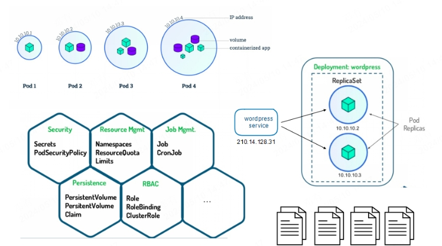
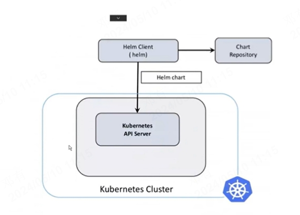
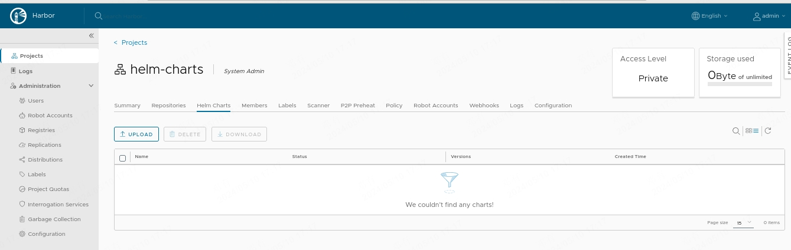
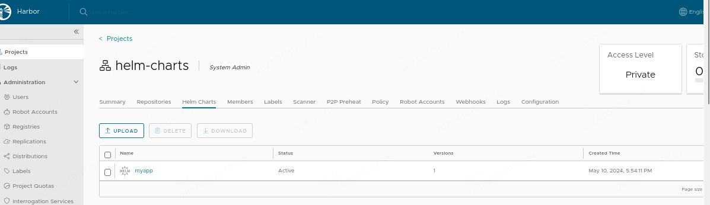
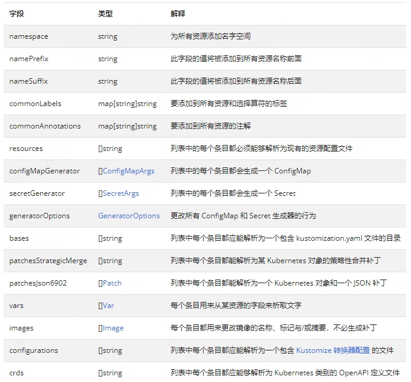
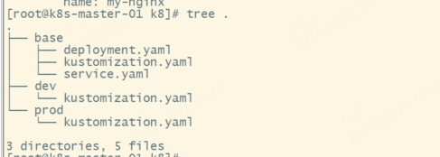

# kubernetes包管理器

## HelmV3

### Helm介绍

> [官网](https://helm.sh/zh/docs/) : `https://helm.sh/zh/docs/`

当今软件开发，随着云原生技术得普及，我们的工程应用进行微服务和容器化的现象也越来越普遍。kubernetes 几乎成为了云原生服务编排绕不开的标准和技术。为了部署一个项目，我们需要多个清单如Deploy、Service、PV、PVC等定义资源如何运行，如何访问等。这是我们就需要有一个工具，高效的对这些资源进行整体管理，并且可以通过简单的修改进行高效复用。而Helm 就是这样的工具，有了Helm，我们可以像在linux中使用yum管理包工具一样，方便快捷的安装、管理、卸载k8s应用，高效的管理YAML资源清单集合，并可以通过配置一些简单的参数对资源进行复用。




### Helm架构

Helm 基于go语言模板，用户只要提供规定的目录结构和模板文件，在真正部署时Helm模板引擎可以将其渲染成可用的k8s资源清单文件，并安装正确的顺序将他们部署到kubernetes集群中。



- Charts：helm 包通过Chart格式来描述应用，类似于rpm包
- Repository：用来存放和共享Chart的地方，类似于yum仓库
- Release：：运行在kubernetes集群内的实例

Helm 作为k8s包管理软件，每次安装Charts到k8s集群时，helm  client 查找repository或者使用版本的Charts使用REST+JSON的方式与API Server进行交互，进而管理deployment、service等资源，在k8s中会创建一个release。

### Helm安装

``` 
~]# wget https://get.helm.sh/helm-v3.10.3-linux-amd64.tar.gz
~]# tar -xf helm-v3.10.3-linux-amd64.tar.gz 
~]# mv linux-amd64/helm /usr/local/bin/
~]# helm version
version.BuildInfo{Version:"v3.10.3", GitCommit:"835b7334cfe2e5e27870ab3ed4135f136eecc704", GitTreeState:"clean", GoVersion:"go1.18.9"}
``` 

### Helm命令

1.Helm 常见命令


| **命令**   | **描述**                                                     |
| ---------- | ------------------------------------------------------------ |
| create     | 创建一个chart并指定名字                                      |
| dependency | 管理chart依赖                                                |
| get        | 下载一个release。可用子命令：all、hooks、manifest、notes、values |
| history    | 获取release历史                                              |
| install    | 安装一个chart                                                |
| list       | 列出release                                                  |
| package    | 将chart目录打包到chart存档文件中                             |
| pull       | 从远程仓库中下载chart并解压到本地  # helm pull stable/mysql --untar |
| repo       | 添加，列出，移除，更新和索引chart仓库。可用子命令：add、index、list、remove、update |
| rollback   | 从之前版本回滚                                               |
| search     | 根据关键字搜索chart。可用子命令：hub、repo                   |
| show       | 查看chart详细信息。可用子命令：all、chart、readme、values    |
| status     | 显示已命名版本的状态                                         |
| template   | 本地呈现模板                                                 |
| uninstall  | 卸载一个release                                              |
| upgrade    | 更新一个release                                              |
| version    | 查看helm客户端版本                                           |

2、配置国内Chart仓库

- 微软仓库（http://mirror.azure.cn/kubernetes/charts/）这个仓库强烈推荐，基本上官网有的chart这里都有。
- 阿里云仓库（https://kubernetes.oss-cn-hangzhou.aliyuncs.com/charts  ）
- 官方仓库（https://hub.kubeapps.com/charts/incubator）官方chart仓库，国内有点不好使
- bitnami： https://charts.bitnami.com/bitnami

```
// 添加存储库
~]# helm repo add stable http://mirror.azure.cn/kubernetes/charts
~]# helm repo add aliyun https://kubernetes.oss-cn-hangzhou.aliyuncs.com/charts 
~]# helm repo add bitnami https://charts.bitnami.com/bitnami
~]# helm repo update
```

```
// 查看配置的存储库
~]# helm repo list 
NAME    URL                                                   
stable  http://mirror.azure.cn/kubernetes/charts              
aliyun  https://kubernetes.oss-cn-hangzhou.aliyuncs.com/charts
~]# helm  search  repo  aliyun
```

```
// 删除存储库
helm repo remove aliyun
```

### Helm使用
#### 1.在线方式部署MySQL
- 搜索charts
``` 
~]# helm search repo mysql
NAME                                    CHART VERSION   APP VERSION     DESCRIPTION                                       
aliyun/mysql                            0.3.5                           Fast, reliable, scalable, and easy to use open-...
bitnami/mysql                           10.2.2          8.0.37          MySQL is a fast, reliable, scalable, and easy t...
stable/mysql                            1.6.9           5.7.30          DEPRECATED - Fast, reliable, scalable, and easy...
```

- 查看charts
```
helm show values stable/mysql
```
- 部署charts
``` 
~]# helm install stable/mysql --generate-name   --set persistence.storageClass=nfs-client  --set mysqlRootPassword=rootpwd123 
NAME: mysql-1715325658
LAST DEPLOYED: Fri May 10 15:21:00 2024
NAMESPACE: default
STATUS: deployed
REVISION: 1
NOTES:
MySQL can be accessed via port 3306 on the following DNS name from within your cluster:
mysql-1715325658.default.svc.cluster.local

To get your root password run:

    MYSQL_ROOT_PASSWORD=$(kubectl get secret --namespace default mysql-1715325658 -o jsonpath="{.data.mysql-root-password}" | base64 --decode; echo)

To connect to your database:

1. Run an Ubuntu pod that you can use as a client:

    kubectl run -i --tty ubuntu --image=ubuntu:16.04 --restart=Never -- bash -il

2. Install the mysql client:

    $ apt-get update && apt-get install mysql-client -y

3. Connect using the mysql cli, then provide your password:
    $ mysql -h mysql-1715325658 -p

To connect to your database directly from outside the K8s cluster:
    MYSQL_HOST=127.0.0.1
    MYSQL_PORT=3306

    # Execute the following command to route the connection:
    kubectl port-forward svc/mysql-1715325658 3306

    mysql -h ${MYSQL_HOST} -P${MYSQL_PORT} -u root -p${MYSQL_ROOT_PASSWORD}
```
> 一个 chart 包是可以多次安装到同一个集群中的，每次安装都会产生一个release, 每个release都可以独立管理和升级
- 查看release状态
``` 
~]# helm list
NAME                    NAMESPACE       REVISION        UPDATED                                 STATUS          CHART           APP VERSION
mysql-1715325658        default         1               2024-05-10 15:21:00.090494201 +0800 CST deployed        mysql-1.6.9     5.7.30     
```
``` 
~]# kubectl  get pod
NAME                                      READY   STATUS    RESTARTS      AGE
mysql-1715325658-7b754bdfc8-v72wd         1/1     Running   0             3m15s
nfs-client-provisioner-685df7bcc5-927kh   1/1     Running   2 (16m ago)   27m
~]# kubectl  get pv
NAME                                       CAPACITY   ACCESS MODES   RECLAIM POLICY   STATUS   CLAIM                      STORAGECLASS   REASON   AGE
pvc-320c40f4-9f72-47e8-8461-2550f88246dd   8Gi        RWO            Delete           Bound    default/mysql-1715325658   nfs-client              3m18s
~]# kubectl  get pvc
NAME               STATUS   VOLUME                                     CAPACITY   ACCESS MODES   STORAGECLASS   AGE
mysql-1715325658   Bound    pvc-320c40f4-9f72-47e8-8461-2550f88246dd   8Gi        RWO            nfs-client     3m21s
~]# kubectl  get svc
NAME               TYPE        CLUSTER-IP       EXTERNAL-IP   PORT(S)    AGE
kubernetes         ClusterIP   10.96.0.1        <none>        443/TCP    3d5h
mysql-1715325658   ClusterIP   10.111.120.197   <none>        3306/TCP   3m24s
```

- 删除Release
  - uninstall
  - delete
``` 
~]# helm del  mysql-1715325658   
```

``` 
# 在删除的时候使用 --keep-history 参数，则会保留 release 的历史记录，该 release 的状态就是 UNINSTALLED，
~]#  helm uninstall mysql-1715326296  --keep-history
release "mysql-1715326296" uninstalled
[root@k8s-master-01 ~]# helm ls -a
NAME                    NAMESPACE       REVISION        UPDATED                                 STATUS          CHART           APP VERSION
mysql-1715326296        default         1               2024-05-10 15:31:37.691519366 +0800 CST uninstalled     mysql-1.6.9     5.7.30     
```
``` 
# 取消删除release
~]# helm rollback mysql-1715326296 1     
Rollback was a success! Happy Helming!
~]# helm list
NAME                    NAMESPACE       REVISION        UPDATED                                 STATUS          CHART           APP VERSION
mysql-1715326296        default         2               2024-05-10 15:33:42.513180988 +0800 CST deployed        mysql-1.6.9     5.7.30  
```


#### 2.定制参数


``` 
~]# helm search repo mysql
NAME                                    CHART VERSION   APP VERSION     DESCRIPTION                                       
stable/mysql                            1.6.9           5.7.30          DEPRECATED - Fast, reliable, scalable, and easy...
```
- 拉取charts到本地并解压
``` 
~]# helm pull stable/mysql --version=1.6.9  --untar
```

- 定制values.yaml
``` 
~]# cd mysql/
mysql]# cp values.yaml values.yaml.bak
# 配置values.yaml如下：
mysql]# diff values.yaml values.yaml.bak 
24c24
< mysqlRootPassword: root123456
---
> # mysqlRootPassword: testing
113c113
<   storageClass: "nfs-client"
---
>   # storageClass: "-"
190c190
<   type: NodePort
---
>   type: ClusterIP
192c192
<   nodePort: 30306
---
>   # nodePort: 32000
```
- 部署charts
```
mysql]# helm install mydb -f values.yaml .

mysql]# kubectl get all -l release=mydb
NAME                             READY   STATUS    RESTARTS   AGE
pod/mydb-mysql-85cc8cc89-rdbfr   1/1     Running   0          2m32s

NAME                 TYPE       CLUSTER-IP       EXTERNAL-IP   PORT(S)          AGE
service/mydb-mysql   NodePort   10.103.114.249   <none>        3306:30306/TCP   2m32s

NAME                         READY   UP-TO-DATE   AVAILABLE   AGE
deployment.apps/mydb-mysql   1/1     1            1           2m32s

NAME                                   DESIRED   CURRENT   READY   AGE
replicaset.apps/mydb-mysql-85cc8cc89   1         1         1       2m32s
```
- 查看覆盖的参数
``` 
mysql]# helm get values mydb
...
persistence:
  accessMode: ReadWriteOnce
  annotations: {}
  enabled: true
  size: 8Gi
  storageClass: nfs-client
```

#### 3.升级和回滚

##### 1.升级

新版本的 chart 包发布的时候，或者当你要更改 release 的配置的时候，你可以使用 helm upgrade 命令来操作。升级需要一个现有的 release，并根据提供的信息对其进行升级。因为 Kubernetes charts 可能很大而且很复杂，Helm 会尝试以最小的侵入性进行升级，它只会更新自上一版本以来发生的变化：

- 升级前查看版本
``` 
mysql]# mysql -uroot -h 192.168.122.21 -P 30306 -p'root123456' -e "select version()"
+-----------+
| version() |
+-----------+
| 5.7.30    |
+-----------+
 mysql]# kubectl  get deployment mydb-mysql -o wide
NAME         READY   UP-TO-DATE   AVAILABLE   AGE   CONTAINERS   IMAGES         SELECTOR
mydb-mysql   1/1     1            1           11m   mydb-mysql   mysql:5.7.30   app=mydb-mysql,release=mydb
```

- 升级镜像为5.7.31
``` 
mysql]# helm upgrade mydb  -f values.yaml  --set imageTag=5.7.31 . 
```

- 升级后确认
``` 
mysql]# mysql -uroot -h 192.168.122.21 -P 30306 -p'root123456' -e "select version()"
+-----------+
| version() |
+-----------+
| 5.7.31    |
+-----------+
mysql]# kubectl  get deployment mydb-mysql -o wide
NAME         READY   UP-TO-DATE   AVAILABLE   AGE   CONTAINERS   IMAGES         SELECTOR
mydb-mysql   1/1     1            1           15m   mydb-mysql   mysql:5.7.31   app=mydb-mysql,release=mydb
```

##### 2.回滚

``` 
mysql]# helm history mydb
REVISION        UPDATED                         STATUS          CHART           APP VERSION     DESCRIPTION     
1               Fri May 10 15:42:50 2024        superseded      mysql-1.6.9     5.7.30          Install complete
2               Fri May 10 15:56:38 2024        deployed        mysql-1.6.9     5.7.30          Upgrade complete
mysql]# helm rollback mydb 1
Rollback was a success! Happy Helming!
mysql]# kubectl  get deployment mydb-mysql -o wide
NAME         READY   UP-TO-DATE   AVAILABLE   AGE   CONTAINERS   IMAGES         SELECTOR
mydb-mysql   0/1     1            0           16m   mydb-mysql   mysql:5.7.30   app=mydb-mysql,release=mydb

mysql]# helm history mydb
REVISION        UPDATED                         STATUS          CHART           APP VERSION     DESCRIPTION     
1               Fri May 10 15:42:50 2024        superseded      mysql-1.6.9     5.7.30          Install complete
2               Fri May 10 15:56:38 2024        superseded      mysql-1.6.9     5.7.30          Upgrade complete
3               Fri May 10 15:59:18 2024        deployed        mysql-1.6.9     5.7.30          Rollback to 1   
```

### Charts开发

#### 1.Charts目录结构

``` 
~]#  helm create myapp

~]# tree myapp/
~]# tree myapp
myapp
├── charts
├── Chart.yaml
├── templates
│   ├── deployment.yaml
│   ├── _helpers.tpl
│   ├── hpa.yaml
│   ├── ingress.yaml
│   ├── NOTES.txt
│   ├── serviceaccount.yaml
│   ├── service.yaml
│   └── tests
│       └── test-connection.yaml
└── values.yaml
```

| 文件              | 说明                                                         | 备注 |
| ----------------- | ------------------------------------------------------------ | --- | 
| Chart.yaml        | 用于描述Chart的基本信息; | 通过 `helm show chart myapp` 查看 | 
| values.yaml       | Chart的默认配置文件;  | 通过 `helm show values myapp/` 查看 |
| README.md         | [可选] 当前Chart的介绍                                       |
| LICENS            | [可选] 协议                                                  |
| requirements.yaml | [可选] 用于存放当前Chart依赖的其它Chart的说明文件            |
| charts/           | [可选]: 该目录中放置当前Chart依赖的其它Chart                 |
| templates/        | [可选]: 部署文件模版目录                                     |


#### 2.Charts预定义变量

| 变量名| 解释 |
| --- | --- |
|Release.Name |发布的名称（不是chart） | 
| Release.Time| chart发布上次更新的时间。这将匹配Last ReleasedRelease对象上的时间| 
| Release.Namespace| chart发布到的名称空间| 
| Release.Service| 进行发布的服务| |
| Release.IsUpgrade| 如果当前操作是升级或回滚，则设置为true| 
|Release.IsInstall |如果当前操作是安装，则设置为true | 
|Release.Revision |修订号。它从1开始，每个都递增helm upgrade | 
|Chart | 内容Chart.yaml| |
|Files | 类似于chart的对象 | 
|Capabilities |类似于地图的对象，包含有关Kubernetes（{{.Capabilities.KubeVersion}} | 

#### 3.开发Chart

##### a.定义Charts描述信息

```
vim myapp/Chart.yaml
apiVersion: v2
name: myapp
description: A Helm chart for Kubernetes.
type: application
version: 0.0.1
appVersion: "1.16.0"
```

##### b.定义deployment.yaml模板

``` 
vim   myapp/templates/deployment.yaml 
apiVersion: apps/v1
kind: Deployment
metadata:
  name: {{ include "myapp.fullname" . }}  
  labels:
    {{- include "myapp.labels" . | nindent 4 }}
spec:
  {{- if not .Values.autoscaling.enabled }}
  replicas: {{ .Values.replicaCount }}
  {{- end }}
  selector:
    matchLabels:
      {{- include "myapp.selectorLabels" . | nindent 6 }}
  template:
    metadata:
      {{- with .Values.podAnnotations }}
      annotations:
        {{- toYaml . | nindent 8 }}
      {{- end }}
      labels:
        {{- include "myapp.selectorLabels" . | nindent 8 }}
    spec:
      {{- with .Values.imagePullSecrets }}
      imagePullSecrets:
        {{- toYaml . | nindent 8 }}
      {{- end }}
      serviceAccountName: {{ include "myapp.serviceAccountName" . }}
      securityContext:
        {{- toYaml .Values.podSecurityContext | nindent 8 }}
      containers:
        - name: {{ .Chart.Name }}
          securityContext:
            {{- toYaml .Values.securityContext | nindent 12 }}
          image: "{{ .Values.image.repository }}:{{ .Values.image.tag | default .Chart.AppVersion }}"
          imagePullPolicy: {{ .Values.image.pullPolicy }}
          ports:
            - name: http
              containerPort: {{ .Values.service.port }}
              protocol: TCP
          livenessProbe:
            httpGet:
              path: /
              port: http
          readinessProbe:
            httpGet:
              path: /
              port: http
          resources:
            {{- toYaml .Values.resources | nindent 12 }}
      {{- with .Values.nodeSelector }}
      nodeSelector:
        {{- toYaml . | nindent 8 }}
      {{- end }}
      {{- with .Values.affinity }}
      affinity:
        {{- toYaml . | nindent 8 }}
      {{- end }}
      {{- with .Values.tolerations }}
      tolerations:
        {{- toYaml . | nindent 8 }}
      {{- end }}
```

##### c.定义service.yaml模板
```
~]# cat myapp/templates/service.yaml 
apiVersion: v1
kind: Service
metadata:
  name: {{ include "myapp.fullname" . }}
  labels:
    {{- include "myapp.labels" . | nindent 4 }}
spec:
  type: {{ .Values.service.type }}
  ports:
    - port: {{ .Values.service.port }}
      targetPort: http
      protocol: TCP
      name: http
  selector:
    {{- include "myapp.selectorLabels" . | nindent 4 }}
```

##### d.定义ingress.yaml模板(可选)
``` 
~]# cat myapp/templates/service.yaml 
apiVersion: v1
kind: Service
metadata:
  name: {{ include "myapp.fullname" . }}
  labels:
    {{- include "myapp.labels" . | nindent 4 }}
spec:
  type: {{ .Values.service.type }}
  ports:
    - port: {{ .Values.service.port }}
      targetPort: http
      protocol: TCP
      name: http
  selector:
    {{- include "myapp.selectorLabels" . | nindent 4 }}
[root@k8s-master-01 ~]# cat myapp/templates/ingress.yaml 
{{- if .Values.ingress.enabled -}}
{{- $fullName := include "myapp.fullname" . -}}
{{- $svcPort := .Values.service.port -}}
{{- if and .Values.ingress.className (not (semverCompare ">=1.18-0" .Capabilities.KubeVersion.GitVersion)) }}
  {{- if not (hasKey .Values.ingress.annotations "kubernetes.io/ingress.class") }}
  {{- $_ := set .Values.ingress.annotations "kubernetes.io/ingress.class" .Values.ingress.className}}
  {{- end }}
{{- end }}
{{- if semverCompare ">=1.19-0" .Capabilities.KubeVersion.GitVersion -}}
apiVersion: networking.k8s.io/v1
{{- else if semverCompare ">=1.14-0" .Capabilities.KubeVersion.GitVersion -}}
apiVersion: networking.k8s.io/v1beta1
{{- else -}}
apiVersion: extensions/v1beta1
{{- end }}
kind: Ingress
metadata:
  name: {{ $fullName }}
  labels:
    {{- include "myapp.labels" . | nindent 4 }}
  {{- with .Values.ingress.annotations }}
  annotations:
    {{- toYaml . | nindent 4 }}
  {{- end }}
spec:
  {{- if and .Values.ingress.className (semverCompare ">=1.18-0" .Capabilities.KubeVersion.GitVersion) }}
  ingressClassName: {{ .Values.ingress.className }}
  {{- end }}
  {{- if .Values.ingress.tls }}
  tls:
    {{- range .Values.ingress.tls }}
    - hosts:
        {{- range .hosts }}
        - {{ . | quote }}
        {{- end }}
      secretName: {{ .secretName }}
    {{- end }}
  {{- end }}
  rules:
    {{- range .Values.ingress.hosts }}
    - host: {{ .host | quote }}
      http:
        paths:
          {{- range .paths }}
          - path: {{ .path }}
            {{- if and .pathType (semverCompare ">=1.18-0" $.Capabilities.KubeVersion.GitVersion) }}
            pathType: {{ .pathType }}
            {{- end }}
            backend:
              {{- if semverCompare ">=1.19-0" $.Capabilities.KubeVersion.GitVersion }}
              service:
                name: {{ $fullName }}
                port:
                  number: {{ $svcPort }}
              {{- else }}
              serviceName: {{ $fullName }}
              servicePort: {{ $svcPort }}
              {{- end }}
          {{- end }}
    {{- end }}
{{- end }}
```

##### e.配置value.yaml

``` 
~]# cat myapp/values.yaml 
# Default values for myapp.
# This is a YAML-formatted file.
# Declare variables to be passed into your templates.

replicaCount: 1

image:
  repository: nginx
  pullPolicy: IfNotPresent
  # Overrides the image tag whose default is the chart appVersion.
  tag: ""

imagePullSecrets: []
nameOverride: ""
fullnameOverride: ""

serviceAccount:
  # Specifies whether a service account should be created
  create: true
  # Annotations to add to the service account
  annotations: {}
  # The name of the service account to use.
  # If not set and create is true, a name is generated using the fullname template
  name: ""

podAnnotations: {}

podSecurityContext: {}
  # fsGroup: 2000

securityContext: {}
  # capabilities:
  #   drop:
  #   - ALL
  # readOnlyRootFilesystem: true
  # runAsNonRoot: true
  # runAsUser: 1000

service:
  type: ClusterIP
  port: 80

ingress:
  enabled: false
  className: ""
  annotations: {}
    # kubernetes.io/ingress.class: nginx
    # kubernetes.io/tls-acme: "true"
  hosts:
    - host: chart-example.local
      paths:
        - path: /
          pathType: ImplementationSpecific
  tls: []
  #  - secretName: chart-example-tls
  #    hosts:
  #      - chart-example.local

resources: {}
  # We usually recommend not to specify default resources and to leave this as a conscious
  # choice for the user. This also increases chances charts run on environments with little
  # resources, such as Minikube. If you do want to specify resources, uncomment the following
  # lines, adjust them as necessary, and remove the curly braces after 'resources:'.
  # limits:
  #   cpu: 100m
  #   memory: 128Mi
  # requests:
  #   cpu: 100m
  #   memory: 128Mi

autoscaling:
  enabled: false
  minReplicas: 1
  maxReplicas: 100
  targetCPUUtilizationPercentage: 80
  # targetMemoryUtilizationPercentage: 80

nodeSelector: {}

tolerations: []

affinity: {}
```

##### f.查看模板渲染后的YAML
``` 
~]# helm install myapp  myapp/  --dry-run          
NAME: myapp
LAST DEPLOYED: Fri May 10 16:40:45 2024
NAMESPACE: default
STATUS: pending-install
REVISION: 1
HOOKS:
---
# Source: myapp/templates/tests/test-connection.yaml
apiVersion: v1
kind: Pod
metadata:
  name: "myapp-test-connection"
  labels:
    helm.sh/chart: myapp-0.1.0
    app.kubernetes.io/name: myapp
    app.kubernetes.io/instance: myapp
    app.kubernetes.io/version: "1.16.0"
    app.kubernetes.io/managed-by: Helm
  annotations:
    "helm.sh/hook": test
spec:
  containers:
    - name: wget
      image: busybox
      command: ['wget']
      args: ['myapp:80']
  restartPolicy: Never
MANIFEST:
---
# Source: myapp/templates/serviceaccount.yaml
apiVersion: v1
kind: ServiceAccount
metadata:
  name: myapp
  labels:
    helm.sh/chart: myapp-0.1.0
    app.kubernetes.io/name: myapp
    app.kubernetes.io/instance: myapp
    app.kubernetes.io/version: "1.16.0"
    app.kubernetes.io/managed-by: Helm
---
# Source: myapp/templates/service.yaml
apiVersion: v1
kind: Service
metadata:
  name: myapp
  labels:
    helm.sh/chart: myapp-0.1.0
    app.kubernetes.io/name: myapp
    app.kubernetes.io/instance: myapp
    app.kubernetes.io/version: "1.16.0"
    app.kubernetes.io/managed-by: Helm
spec:
  type: ClusterIP
  ports:
    - port: 80
      targetPort: http
      protocol: TCP
      name: http
  selector:
    app.kubernetes.io/name: myapp
    app.kubernetes.io/instance: myapp
---
# Source: myapp/templates/deployment.yaml
apiVersion: apps/v1
kind: Deployment
metadata:
  name: myapp
  labels:
    helm.sh/chart: myapp-0.1.0
    app.kubernetes.io/name: myapp
    app.kubernetes.io/instance: myapp
    app.kubernetes.io/version: "1.16.0"
    app.kubernetes.io/managed-by: Helm
spec:
  replicas: 1
  selector:
    matchLabels:
      app.kubernetes.io/name: myapp
      app.kubernetes.io/instance: myapp
  template:
    metadata:
      labels:
        app.kubernetes.io/name: myapp
        app.kubernetes.io/instance: myapp
    spec:
      serviceAccountName: myapp
      securityContext:
        {}
      containers:
        - name: myapp
          securityContext:
            {}
          image: "nginx:1.16.0"
          imagePullPolicy: IfNotPresent
          ports:
            - name: http
              containerPort: 80
              protocol: TCP
          livenessProbe:
            httpGet:
              path: /
              port: http
          readinessProbe:
            httpGet:
              path: /
              port: http
          resources:
            {}

NOTES:
1. Get the application URL by running these commands:
  export POD_NAME=$(kubectl get pods --namespace default -l "app.kubernetes.io/name=myapp,app.kubernetes.io/instance=myapp" -o jsonpath="{.items[0].metadata.name}")
  export CONTAINER_PORT=$(kubectl get pod --namespace default $POD_NAME -o jsonpath="{.spec.containers[0].ports[0].containerPort}")
  echo "Visit http://127.0.0.1:8080 to use your application"
  kubectl --namespace default port-forward $POD_NAME 8080:$CONTAINER_PORT
```

##### g.部署myapp

``` 
~]# helm install myapp  myapp/  -n test
NAME: myapp
LAST DEPLOYED: Fri May 10 16:42:40 2024
NAMESPACE: test
STATUS: deployed
REVISION: 1
NOTES:
1. Get the application URL by running these commands:
  export POD_NAME=$(kubectl get pods --namespace test -l "app.kubernetes.io/name=myapp,app.kubernetes.io/instance=myapp" -o jsonpath="{.items[0].metadata.name}")
  export CONTAINER_PORT=$(kubectl get pod --namespace test $POD_NAME -o jsonpath="{.spec.containers[0].ports[0].containerPort}")
  echo "Visit http://127.0.0.1:8080 to use your application"
  kubectl --namespace test port-forward $POD_NAME 8080:$CONTAINER_PORT
```
``` 
~]# helm ls -n test
NAME    NAMESPACE       REVISION        UPDATED                                 STATUS          CHART           APP VERSION
myapp   test            1               2024-05-10 16:42:40.202562735 +0800 CST deployed        myapp-0.1.0     1.16.0    
```

### Chart包托管

> 前提： 托管Chart包到Habro仓库，Harbor仓库安装时需支持chart,实例代码：`./install.sh --with-chartmuseum`


``` 
~]# docker login reg.linux.io -uadmin -padmin123
```


#### 1.安装push插件

```shell
~]# yum install -y git
~]# helm plugin install https://github.com/chartmuseum/helm-push
~]# helm plugin install https://github.com/chartmuseum/helm-push
Downloading and installing helm-push v0.10.4 ...
https://github.com/chartmuseum/helm-push/releases/download/v0.10.4/helm-push_0.10.4_linux_amd64.tar.gz
Installed plugin: cm-push

~]# ls /root/.local/share/helm/plugins/helm-push/bin/
helm-cm-push
```

#### 2.打包应用

``` 
~]# cd myapp/
myapp]# ls
charts  Chart.yaml  templates  values.yaml

myapp]# helm package .
Successfully packaged chart and saved it to: /root/myapp/myapp-0.1.0.tgz
```

#### 3.添加harbor为helm仓库

```
~]# cd /etc/docker/certs.d/reg.linux.io
reg.linux.io]# helm repo add --ca-file ca.crt  \
  --cert-file reg.linux.io.cert \
  --key-file reg.linux.io.key   \
  --username admin --password admin123 \
  helmharbor https://reg.linux.io/chartrepo/helm-charts 
```
- helm-charts :项目名

#### 4.推送charts到Harbor

```
reg.linux.io]# helm cm-push --ca-file ca.crt \
   --cert-file reg.linux.io.cert \
   --key-file reg.linux.io.key   \
   --username admin --password admin123  \
   /root/myapp/myapp-0.1.0.tgz  helmharbor
```



#### 5.使用charts

```shell
reg.linux.io]# helm install --ca-file ca.crt  \
  --cert-file reg.linux.io.cert \
  --key-file reg.linux.io.key   \
  --username admin --password admin123 \
  --version 0.1.0 helmharbor/myapp 
```

## Kustomize

### Kustomize介绍

> [官网](https://kubernetes.io/zh-cn/docs/tasks/manage-kubernetes-objects/kustomization/) : `https://kubernetes.io/zh-cn/docs/tasks/manage-kubernetes-objects/kustomization/`

为了解决不同应用在不同环境中存在使用不同配置参数的复杂问题，容器的生太出现了helm，他简化了应用部署的管理难度。helm 类似与kubernetes程序包管理器，用于应用的配置分发，版本控制、查找等操作。他的核心功能十八 kubernetes资源对象打包到一个Charts中，制作完成的各个Charts保存到Charts仓库进行存储和转发。虽然helm可以解决资源对象声明周期管理已经通过模板进行版本控制，但是helm使用起来复杂，只想管理不同环境的yaml配置，helm引入了模板的概念，是的使用的复杂度更高。所以云原生社区提供了一个Kustomize工具，这个工具可以打包不同环境的yaml配置，，并在kubernetes v1.14以后集成到kubectl命令中，这是一个比Helm更轻量的配置管理工具。

- helm： 包管理工具
- kustomize：配置管理工具

> helm为了解决kubernetes集群中包安装管理的问题，kustomize是组合多个yaml实现轻量程序配置的工具

### Kustomize设计理念

Kustomize 允许用户以一个应用描述文件(YAML文件) 为基础(Base YAML),然后通过Overlay的方式生成最终部署应用所需要的描述文件。两者都是由 kustomization 文件表示。 基础(Base YAML)声明了共享的内容(资源清单和常见的资源配置)，Overlay则声明了差异，他的设计目的是给 kubernets的用户提供一种可以重复使用同一套配置的声明式应用管理，从而在配置工作中的用户只需要管理和维护 kubernetes 的Api 对象，而不需要学习或安装其它的配置管理工具，也不需要复制粘贴来得到新的环境的配置。

**Kustomize 是一个独立的工具，用来通过 kustomization 文件定制kubernetes对象**
- 从其它来源生成资源
- 为资源设置贯穿性字段
- 组织和定制资源集合

### Kustomize 使用

#### 1.管理资源对象

从 kuberentes v1.14版本开始，kubectl 原生支持使用 kustomization 文件来管理 kubernetes对象

- 命令格式
  - 渲染：kubectl kustomize <customization_dir>
  - 应用： kubectl apply -k <customization_dir>

#### 2.configMapGenerator生成资源

1. 基于属性文件生成configmap

```
#根据 application.properties文件的数据生成ConfigMap示例
k1]# cat > application.properties <<EOF
FOO=Bar
EOF

# 编写kustomization文件
k1]# cat > ./kustomization.yaml  <<EOF
configMapGenerator:
- name: example-cm-01
  files:
  - application.properties
EOF

# 查看渲染结果
k1]# kubectl kustomize ./
apiVersion: v1
data:
  application.properties: |
    FOO=Bar
kind: ConfigMap
metadata:
  name: example-cm-01-g4hk9g2ff8
  
# 应用部署cm
k1]# kubectl  apply -k ./ -n test
configmap/example-cm-01-g4hk9g2ff8 created
k1]# kubectl  get cm -n test
NAME                       DATA   AGE
example-cm-01-g4hk9g2ff8   1      6s
```
2.使用env文件生成属性文件
```
k2]# cat > envfile <<EOF
For=Bar
EOF

k2]# cat > ./kustomization.yaml <<EOF
configMapGenerator:
- name: example-cm-02
  envs:
  - envfile
EOF

# 查看渲染
k2]# kubectl  kustomize ./                 
apiVersion: v1
data:
  For: Bar
kind: ConfigMap
metadata:
  name: example-cm-02-h55gh45c9d
```

#### 3.使用configMapGenerator生成configMap

在Deployment资源中使用由configMapGenerator生成的configmap

``` 
# 准备 application.properties文件的数据用于生成ConfigMap
cat <<EOF >application.properties
FOO=Bar
EOF

cat <<EOF >deployment.yaml
apiVersion: apps/v1
kind: Deployment
metadata:
  name: nginx
  labels:
    app: nginx
spec:
  selector:
    matchLabels:
      app: nginx
  template:
    metadata:
      labels:
        app: nginx
    spec:
      containers:
      - name: app
        image: nginx:1.20
        volumeMounts:
        - name: config
          mountPath: /config
      volumes:
      - name: config
        configMap:
          name: example-configmap-1 # 这里需要匹配下面的name
EOF

cat <<EOF >./kustomization.yaml
resources:
- deployment.yaml
configMapGenerator:
- name: example-configmap-1
  files:
  - application.properties
EOF
```

#### 4.设置贯穿性字段
在项目中为所有 Kubernetes 对象设置贯穿性字段是一种常见操作。 贯穿性字段的一些使用场景如下：

- 为所有资源设置相同的名字空间
- 为所有对象添加相同的前缀或后缀
- 为对象添加相同的标签集合
- 为对象添加相同的注解集合

``` 
# 创建一个 deployment.yaml
cat <<EOF >./deployment.yaml
apiVersion: apps/v1
kind: Deployment
metadata:
  name: nginx-deployment
  labels:
    app: nginx
spec:
  selector:
    matchLabels:
      app: nginx
  template:
    metadata:
      labels:
        app: nginx
    spec:
      containers:
      - name: nginx
        image: nginx
EOF

cat <<EOF >./kustomization.yml
namespace: dev
namePrefix: dev-
nameSuffix: "-001"
commonLabels:
  app: bingo
commonAnnotations:
  oncallPager: 800-555-1212
resources:
- deployment.yaml
EOF
```
```shell
k5]# kubectl  kustomize ./
apiVersion: apps/v1
kind: Deployment
metadata:
  annotations:
    oncallPager: 800-555-1212
  labels:
    app: bingo
  name: dev-nginx-deployment-001
  namespace: dev
spec:
  selector:
    matchLabels:
      app: bingo
  template:
    metadata:
      annotations:
        oncallPager: 800-555-1212
      labels:
        app: bingo
    spec:
      containers:
      - image: nginx
        name: nginx
```

#### 5.定制和组合资源

一种常见的做法是在项目中构造资源集合并将其放到同一个文件或目录中管理。 Kustomize 提供基于不同文件来组织资源并向其应用补丁或者其他定制的能力

##### 1.组合

``` 
# 创建 deployment.yaml 文件
cat <<EOF > deployment.yaml
apiVersion: apps/v1
kind: Deployment
metadata:
  name: my-nginx
spec:
  selector:
    matchLabels:
      run: my-nginx
  replicas: 2
  template:
    metadata:
      labels:
        run: my-nginx
    spec:
      containers:
      - name: my-nginx
        image: nginx
        ports:
        - containerPort: 80
EOF

# 创建 service.yaml 文件
cat <<EOF > service.yaml
apiVersion: v1
kind: Service
metadata:
  name: my-nginx
  labels:
    run: my-nginx
spec:
  ports:
  - port: 80
    protocol: TCP
  selector:
    run: my-nginx
EOF

# 创建 kustomization.yaml 来组织以上两个资源
cat <<EOF >./kustomization.yaml
resources:
- deployment.yaml
- service.yaml
EOF
```

##### 2.定制

补丁文件（Patches）可以用来对资源执行不同的定制

- patchesStrategicMerge： 策略性合并补丁（Strategic Merge Patch）， 补丁文件中的名称必须与已经加载的资源的名称匹
- patchesJson6902: 应用 JSON 补丁，支持对任何资源的任何字段进行修改



**1.patchesStrategicMerge补丁**
构造一个补丁来增加 Deployment 的副本个数；构造另外一个补丁来设置内存限制
``` 
# 创建 deployment.yaml 文件
cat <<EOF > deployment.yaml
apiVersion: apps/v1
kind: Deployment
metadata:
  name: my-nginx
spec:
  selector:
    matchLabels:
      run: my-nginx
  replicas: 2
  template:
    metadata:
      labels:
        run: my-nginx
    spec:
      containers:
      - name: my-nginx
        image: nginx
        ports:
        - containerPort: 80
EOF

# 生成一个补丁 increase_replicas.yaml
cat <<EOF > increase_replicas.yaml
apiVersion: apps/v1
kind: Deployment
metadata:
  name: my-nginx
spec:
  replicas: 3
EOF

# 生成另一个补丁 set_memory.yaml
cat <<EOF > set_memory.yaml
apiVersion: apps/v1
kind: Deployment
metadata:
  name: my-nginx
spec:
  template:
    spec:
      containers:
      - name: my-nginx
        resources:
          limits:
            memory: 512Mi
EOF

cat <<EOF >./kustomization.yaml
resources:
- deployment.yaml
patchesStrategicMerge:
- increase_replicas.yaml
- set_memory.yaml
EOF
```

**2.JSON应用补丁**

为了给 JSON 补丁找到正确的资源，需要在 kustomization.yaml 文件中指定资源的组（group）、 版本（version）、类别（kind）和名称（name），支持对任何资源的任何字段进行修改。

```shell
# 创建一个 deployment.yaml 文件
cat <<EOF > deployment.yaml
apiVersion: apps/v1
kind: Deployment
metadata:
  name: my-nginx
spec:
  selector:
    matchLabels:
      run: my-nginx
  replicas: 2
  template:
    metadata:
      labels:
        run: my-nginx
    spec:
      containers:
      - name: my-nginx
        image: nginx
        ports:
        - containerPort: 80
EOF

# 创建第一个 JSON 补丁文件
cat <<EOF > patch.yaml
- op: replace
  path: /spec/replicas
  value: 3
EOF
# 创建第二个JSON补丁文件
cat <<EOF > patch_namespace.yaml
- op: replace
  path: /metadata/namespace
  value: test
EOF

# 创建一个 kustomization.yaml
cat <<EOF >./kustomization.yaml
resources:
- deployment.yaml

patchesJson6902:
- target:
    group: apps
    version: v1
    kind: Deployment
    name: my-nginx
  path: patch.yaml
- target:
    group: apps
    version: v1
    kind: Deployment
    name: my-nginx
  path: patch_namespace.yaml
EOF
```

**3.定制容器镜像或者字段注入**

除了补丁之外，Kustomize 还提供定制容器镜像或者将其他对象的字段值注入到容器中的能力，并且不需要创建补丁。 例如，你可以通过在 kustomization.yaml 文件的 images 字段设置新的镜像来更改容器中使用的镜像。

``` 
cat <<EOF > deployment.yaml
apiVersion: apps/v1
kind: Deployment
metadata:
  name: my-nginx
spec:
  selector:
    matchLabels:
      run: my-nginx
  replicas: 2
  template:
    metadata:
      labels:
        run: my-nginx
    spec:
      containers:
      - name: my-nginx
        image: nginx
        ports:
        - containerPort: 80
EOF

cat <<EOF >./kustomization.yaml
resources:
- deployment.yaml
images:
- name: nginx
  newName: my.image.registry/nginx
  newTag: 1.4.0
EOF
```

有些时候，Pod 中运行的应用可能需要使用来自其他对象的配置值。 例如，某 Deployment 对象的 Pod 需要从环境变量或命令行参数中读取读取 Service 的名称。 由于在 kustomization.yaml 文件中添加 namePrefix 或 nameSuffix 时 Service 名称可能发生变化，建议不要在命令参数中硬编码 Service 名称。 对于这种使用场景，Kustomize 可以通过 vars 将 Service 名称注入到容器中。

``` 
# 创建一个 deployment.yaml 文件（引用此处的文档分隔符）
cat <<'EOF' > deployment.yaml
apiVersion: apps/v1
kind: Deployment
metadata:
  name: my-nginx
spec:
  selector:
    matchLabels:
      run: my-nginx
  replicas: 2
  template:
    metadata:
      labels:
        run: my-nginx
    spec:
      containers:
      - name: my-nginx
        image: nginx
        command: ["start", "--host", "$(MY_SERVICE_NAME)"]
EOF

# 创建一个 service.yaml 文件
cat <<EOF > service.yaml
apiVersion: v1
kind: Service
metadata:
  name: my-nginx
  labels:
    run: my-nginx
spec:
  ports:
  - port: 80
    protocol: TCP
  selector:
    run: my-nginx
EOF

cat <<EOF >./kustomization.yaml
namePrefix: dev-
nameSuffix: "-001"

resources:
- deployment.yaml
- service.yaml

vars:
- name: MY_SERVICE_NAME
  objref:
    kind: Service
    name: my-nginx
    apiVersion: v1
EOF
```
``` 
kubectl kustomize .
apiVersion: apps/v1
kind: Deployment
metadata:
  name: dev-my-nginx-001
spec:
  replicas: 2
  selector:
    matchLabels:
      run: my-nginx
  template:
    metadata:
      labels:
        run: my-nginx
    spec:
      containers:
      - command:
        - start
        - --host
        - dev-my-nginx-001
        image: nginx
        name: my-nginx
```

### 基准与覆盖

Kustomize 中有 基准（bases） 和 覆盖（overlays） 的概念区分。 基准 是包含 kustomization.yaml 文件的一个目录，其中包含一组资源及其相关的定制。 基准可以是本地目录或者来自远程仓库的目录，只要其中存在 kustomization.yaml 文件即可。 覆盖 也是一个目录，其中包含将其他 kustomization 目录当做 bases 来引用的 kustomization.yaml 文件。 基准不了解覆盖的存在，且可被多个覆盖所使用。 覆盖则可以有多个基准，且可针对所有基准中的资源执行组织操作，还可以在其上执行定制。



```shell
# 创建一个包含基准的目录
mkdir base
# 创建 base/deployment.yaml
cat <<EOF > base/deployment.yaml
apiVersion: apps/v1
kind: Deployment
metadata:
  name: my-nginx
spec:
  selector:
    matchLabels:
      run: my-nginx
  replicas: 2
  template:
    metadata:
      labels:
        run: my-nginx
    spec:
      containers:
      - name: my-nginx
        image: nginx
EOF

# 创建 base/service.yaml 文件
cat <<EOF > base/service.yaml
apiVersion: v1
kind: Service
metadata:
  name: my-nginx
  labels:
    run: my-nginx
spec:
  ports:
  - port: 80
    protocol: TCP
  selector:
    run: my-nginx
EOF

# 创建 base/kustomization.yaml
cat <<EOF > base/kustomization.yaml
resources:
- deployment.yaml
- service.yaml
EOF
```

此基准可在多个覆盖中使用。你可以在不同的覆盖中添加不同的 namePrefix 或其他贯穿性字段。 下面是两个使用同一基准的覆盖：

```shell
mkdir dev
cat <<EOF > dev/kustomization.yaml
resources:
- ../base
namespace: dev
EOF


[root@k8s-master-01 k8]# kubectl  kustomize dev/           
apiVersion: v1
kind: Service
metadata:
  labels:
    run: my-nginx
  name: my-nginx
  namespace: dev
spec:
  ports:
  - port: 80
    protocol: TCP
  selector:
    run: my-nginx
---
apiVersion: apps/v1
kind: Deployment
metadata:
  name: my-nginx
  namespace: dev
spec:
  replicas: 2
  selector:
    matchLabels:
      run: my-nginx
  template:
    metadata:
      labels:
        run: my-nginx
    spec:
      containers:
      - image: nginx
        name: my-nginx
```
```
mkdir prod
cat <<EOF > prod/kustomization.yaml
resources:
- ../base
namespace: prod
EOF

k8]# kubectl  kustomize prod/
apiVersion: v1
kind: Service
metadata:
  labels:
    run: my-nginx
  name: my-nginx
  namespace: prod
spec:
  ports:
  - port: 80
    protocol: TCP
  selector:
    run: my-nginx
---
apiVersion: apps/v1
kind: Deployment
metadata:
  name: my-nginx
  namespace: prod
spec:
  replicas: 2
  selector:
    matchLabels:
      run: my-nginx
  template:
    metadata:
      labels:
        run: my-nginx
    spec:
      containers:
      - image: nginx
        name: my-nginx
```

### kustomize管理对象

#### 1.应用对象
```shell
kubectl apply -k <customize_dir>
```

#### 2.查看对象

```shell
kubectl get -k <customize_dir>
```
``` 
kubectl describe -k <customize_dir>
```

#### 3.比较对象
比较对象与清单被应用之后集群将处于的状态
``` 
kubectl diff -k <customize_dir>
```

#### 4.删除对象

``` 
kubectl delete -k ./
```

