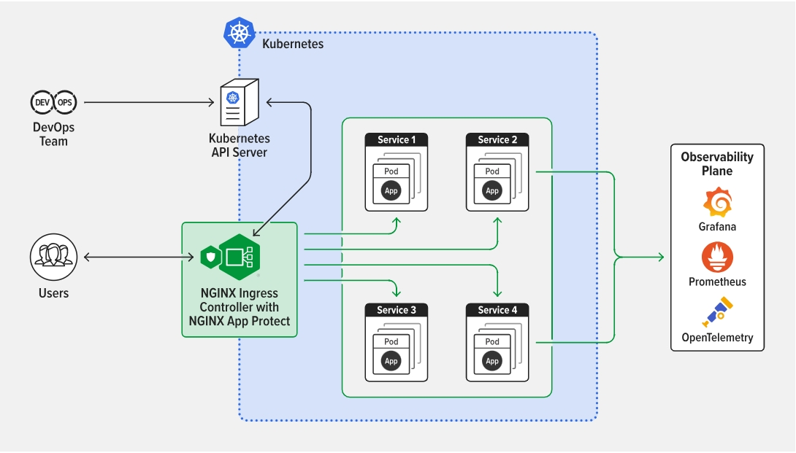
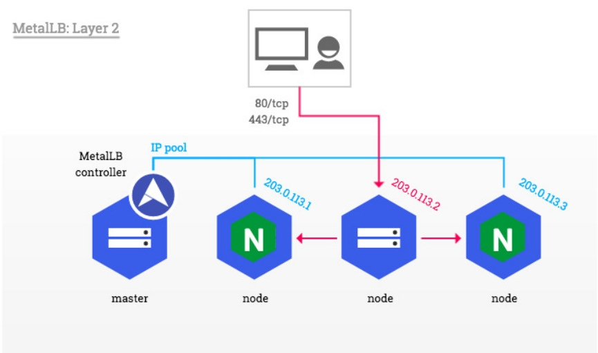

# kubernetes服务暴露

## Ingress-Nginx

Ingress Controller可以为Kubernertes集群外部用户访问集群内部Pod提供代理服务。ingress-nginx 是 Kubernetes 的 Ingress 控制器，使用 NGINX 作为反向代理和加载 平衡器

- 提供全局访问代理
- 访问流程
  - user -> ingress controller -> service -> pod




### Ingress-nginx部署

> [官网](https://kubernetes.github.io/ingress-nginx/deploy/#bare-metal-clusters) : `https://kubernetes.github.io/ingress-nginx/deploy/#bare-metal-clusters`

这里使用裸机方式部署，结合MetalLB提供外网访问，部署结构如图所示：


1. 获取资源清单进行部署
``` 
wget https://raw.githubusercontent.com/kubernetes/ingress-nginx/controller-v1.3.1/deploy/static/provider/baremetal/deploy.yaml
# cp deploy.yaml{,.bak}
# 修改镜像地址，修改Service类型为LoadBalancer，结合MetalLB使用
diff deploy.yaml{,.bak}
364c364
<   type: LoadBalancer
---
>   type: NodePort
436c436
<         image: k8s.dockerproxy.com/ingress-nginx/controller:v1.3.1@sha256:54f7fe2c6c5a9db9a0ebf1131797109bb7a4d91f56b9b362bde2abd237dd1974
---
>         image: registry.k8s.io/ingress-nginx/controller:v1.3.1@sha256:54f7fe2c6c5a9db9a0ebf1131797109bb7a4d91f56b9b362bde2abd237dd1974
533c533
<         image: k8s.dockerproxy.com/ingress-nginx/kube-webhook-certgen:v1.3.0@sha256:549e71a6ca248c5abd51cdb73dbc3083df62cf92ed5e6147c780e30f7e007a47
---
>         image: registry.k8s.io/ingress-nginx/kube-webhook-certgen:v1.3.0@sha256:549e71a6ca248c5abd51cdb73dbc3083df62cf92ed5e6147c780e30f7e007a47
582c582
<         image: k8s.dockerproxy.com/ingress-nginx/kube-webhook-certgen:v1.3.0@sha256:549e71a6ca248c5abd51cdb73dbc3083df62cf92ed5e6147c780e30f7e007a47
---
>         image: registry.k8s.io/ingress-nginx/kube-webhook-certgen:v1.3.0@sha256:549e71a6ca248c5abd51cdb73dbc3083df62cf92ed5e6147c780e30f7e007a47
kubectl apply -f deploy.yaml
```

2.验证部署情况
```
ingress]kubectl  get pod -n ingress-nginx 
NAME                                        READY   STATUS      RESTARTS   AGE
ingress-nginx-admission-create--1-m658v     0/1     Completed   0          14m
ingress-nginx-admission-patch--1-sxfpk      0/1     Completed   2          14m
ingress-nginx-controller-6999c5895f-228xh   1/1     Running     0          14m
[root@k8s-master-01 ingress]# kubectl  get svc -n ingress-nginx    
NAME                                 TYPE           CLUSTER-IP       EXTERNAL-IP       PORT(S)                      AGE
ingress-nginx-controller             LoadBalancer   10.100.207.142   192.168.122.240   80:31690/TCP,443:31329/TCP   14m
ingress-nginx-controller-admission   ClusterIP      10.111.221.249   <none>            443/TCP                      14m
```

### Ingress-Nginx使用

#### 简单的HTTP代理

1. 准备 deploy和svc 资源
``` 
cat myapp-deply-svc.yaml 
---
apiVersion: apps/v1
kind: Deployment
metadata:
  name: myapp
  namespace: test
  labels:
    app: myapp
spec:
  replicas: 3
  selector:
    matchLabels:
      app: myapp
  template:
    metadata:
      labels:
        app: myapp
    spec:
      containers:
      - image: ikubernetes/myapp:v1
        name: myapp
---
apiVersion: v1
kind: Service
metadata:
  name: myapp-svc
  namespace: test
spec:
  type: ClusterIP
  ports:
  - name: http
    port: 80
    targetPort: 80
  selector:
    app: myapp
kubectl apply -f myapp-deply-svc.yaml 
```
2.编写Ingress规则
``` 
 cat myapp-deply-svc.yaml 
---
apiVersion: apps/v1
kind: Deployment
metadata:
  name: myapp
  namespace: test
  labels:
    app: myapp
spec:
  replicas: 3
  selector:
    matchLabels:
      app: myapp
  template:
    metadata:
      labels:
        app: myapp
    spec:
      containers:
      - image: ikubernetes/myapp:v1
        name: myapp
---
apiVersion: v1
kind: Service
metadata:
  name: myapp-svc
  namespace: test
spec:
  type: ClusterIP
  ports:
  - name: http
    port: 80
    targetPort: 80
  selector:
    app: myapp
    
#  kubectl  get   ingress ingress-myapp -n test        
NAME            CLASS    HOSTS              ADDRESS          PORTS   AGE
ingress-myapp   <none>   myappv1.linux.io   192.168.122.33   80      89s
```

3.验证
``` 
# 这里使用curl命令进行验证，如果使用浏览器，则需要hosts文件能解析域名myappv1.linux.io
curl -D- http://192.168.122.240 -H 'Host: myappv1.linux.io' 
HTTP/1.1 200 OK
Date: Wed, 08 May 2024 06:42:27 GMT
Content-Type: text/html
Content-Length: 65
Connection: keep-alive
Last-Modified: Fri, 02 Mar 2018 03:39:12 GMT
ETag: "5a98c760-41"
Accept-Ranges: bytes

Hello MyApp | Version: v1 | <a href="hostname.html">Pod Name</a>
```
#### URI重写

实现类似用户路由匹配规则如下
- `http://NGINX/v1`请求转发到`http://myapp-svc1:80/`, 
- `http://NGINX/v2`请求转发到`http://myapp-svc1:80/`,

伪代码如下：
``` 
  location /v1 {
     proxy_pass http://myapp-svc-1:80/;
  }
  location /v2 {
     proxy_pass http://myapp-svc-2:80/;
  }
```

1. 准备 myapp1 的deploy、svc 资源
``` 
cat myapp1-deply-svc.yaml 
---
apiVersion: apps/v1
kind: Deployment
metadata:
  name: myapp1
  namespace: test
  labels:
    app: myapp1
spec:
  replicas: 3
  selector:
    matchLabels:
      app: myapp1
  template:
    metadata:
      labels:
        app: myapp1
    spec:
      containers:
      - image: ikubernetes/myapp:v1
        name: myapp1
---
apiVersion: v1
kind: Service
metadata:
  name: myapp-svc-1
  namespace: test
spec:
  type: ClusterIP
  ports:
  - name: http
    port: 80
    targetPort: 80
  selector:
    app: myapp1
```
2.准备myapp2的 deploy、svc资源
``` 
 cat myapp2-deply-svc.yaml 
---
apiVersion: apps/v1
kind: Deployment
metadata:
  name: myapp2
  namespace: test
  labels:
    app: myapp2
spec:
  replicas: 3
  selector:
    matchLabels:
      app: myapp2
  template:
    metadata:
      labels:
        app: myapp2
    spec:
      containers:
      - image: ikubernetes/myapp:v2
        name: myapp2
---
apiVersion: v1
kind: Service
metadata:
  name: myapp-svc-2
  namespace: test
spec:
  type: ClusterIP
  ports:
  - name: http
    port: 80
    targetPort: 80
  selector:
    app: myapp2
```

2. 编写Ingrss规则
```
kubectl  get svc -n test     
NAME          TYPE        CLUSTER-IP       EXTERNAL-IP   PORT(S)   AGE
myapp-svc-1   ClusterIP   10.103.206.189   <none>        80/TCP    7m5s
myapp-svc-2   ClusterIP   10.97.141.235    <none>        80/TCP    6m11s

cat ingress-myapp.yaml
apiVersion: networking.k8s.io/v1
kind: Ingress
metadata:
  name: ingress-myapp
  namespace: test
  annotations:
    ingressclass.kubernetes.io/is-default-class: "true"
    kubernetes.io/ingress.class: nginx
    nginx.ingress.kubernetes.io/rewrite-target: /$2
spec:
  ingressClassName: nginx
  rules:
    - host: m.linux.io
      http:
        paths:
          - path: /v1(/|$)(.*)
            pathType: Prefix
            backend:
              service:
                name: myapp-svc-1
                port:
                  number: 80
          - path: /v2(/|$)(.*)
            pathType: Prefix
            backend:
              service:
                name: myapp-svc-2
                port:
kubectl apply -f ingress-myapp.yaml
```

3. 验证
``` 
http_uri_rewrite]# curl  http://192.168.122.240/v1 -H 'Host: m.linux.io'     
Hello MyApp | Version: v1 | <a href="hostname.html">Pod Name</a>
http_uri_rewrite]# curl  http://192.168.122.240/v2 -H 'Host: m.linux.io'   
Hello MyApp | Version: v2 | <a href="hostname.html">Pod Name</a>
```

#### HTTPS案例

1.创建自签证书
``` 
openssl req -x509 -nodes -days 365 -newkey rsa:2048 -keyout tls.key -out tls.crt -subj "/CN=tls.linux.io" 
Generating a 2048 bit RSA private key
.........................................................................................................+++
.................+++
writing new private key to 'tls.key'
-----
[root@k8s-master-01 https]# ls
tls.crt  tls.key
```

2.将证书创建成secret
```
# 要注意证书文件名称必须是 tls.crt 和 tls.key
kubectl create secret tls myapp-tls-secret --cert=tls.crt --key=tls.key -n test
secret/nginx-tls-secret created
```
3.准备myapp的deploy、svc资源
```
---
apiVersion: apps/v1
kind: Deployment
metadata:
  name: myapp
  namespace: test
  labels:
    app: myapp
spec:
  replicas: 3
  selector:
    matchLabels:
      app: myapp
  template:
    metadata:
      labels:
        app: myapp
    spec:
      containers:
      - image: ikubernetes/myapp:v1
        name: myapp
---
apiVersion: v1
kind: Service
metadata:
  name: myapp-svc
  namespace: test
spec:
  type: ClusterIP
  ports:
  - name: http
    port: 80
    targetPort: 80
  selector:
    app: myapp
https]# kubectl apply -f myapp-deply-svc.yaml 
https]# kubectl  get deploy -n test
NAME    READY   UP-TO-DATE   AVAILABLE   AGE
myapp   3/3     3            3           85m
https]# kubectl  get svc -n test      
NAME        TYPE        CLUSTER-IP      EXTERNAL-IP   PORT(S)   AGE
myapp-svc   ClusterIP   10.109.213.74   <none>        80/TCP    17s
```
4.创建Ingress规则
``` 
cat ingress-https.yaml 
---
apiVersion: networking.k8s.io/v1
kind: Ingress
metadata:
  name: ingress-myapp-tls
  namespace: test
  annotations:
    ingressclass.kubernetes.io/is-default-class: "true"
    kubernetes.io/ingress.class: "nginx"
spec:
  tls: # 配置 tls 证书
    - hosts:
        - tls.linux.io
      secretName: myapp-tls-secret
  rules:
    - host: tls.linux.io
      http:
        paths:
          - path: /
            pathType: Prefix
            backend:
              service:
                name: myapp-svc
                port:
                  number: 80
https]# kubectl  apply -f ingress-https.yaml
```

5.验证
``` 
# 建议使用浏览器验证，这样更明显
curl  -k https://192.168.122.240 -H 'Host: tls.linux.io'   
Hello MyApp | Version: v1 | <a href="hostname.html">Pod Name</a>
```

### 灰度发布

在互联网公司，为了满足业务的快速发展，我们经常需要对应用进行升级发版，其中常见的发布方式有滚动更新、蓝绿部署、灰度发布等

- 滚动更新：依次进行新旧替换，知道旧得服务全部被替换
- 蓝绿部署： 两套独立的系统，当蓝系统里面的应用测试完毕以后，切换用户流量到蓝系统中，此时蓝系统将成为绿系统，绿系统可以销毁
  - 绿系统: 对外提供服务
  - 蓝系统：待上线得服务
- 灰度发布：在一套系统中存在稳定版本和灰度版本，待灰度版本测试完成后，可以将灰度版本升级完稳定版本，旧得稳定系统就可以下线，也成为金丝雀发布
  - 灰度版本：针对部分人员可用，用于测试目的

下面我们通过ingress-nginx实现灰度发布

#### ingress-nginx实现灰度发布原理
 
ingress-nginx是Kubernetes官方推荐得ingress controller，他是基于nginx实现的，增加了一组额外功能得Lua插件，为了实现灰度发布，ingress-nginx通过定义annotation来实现不同常见得灰度发布，其支持得Canary 规则如下

- nginx.ingress.kubernetes.io/canary-by-header: 基于请求头部Request Header进行流量切分，适合灰度发布以及A/B测试
  - 当Request Header设置为always时，请求会一直发送到Canary版本
  - 当Request Header设置为always时，请求不会发送到Canary版本
  - 当Request Header设置为其它任意值时，将忽略请求头部，比沟通过优先级请求与其它规则进行比较
- nginx.ingress.kubernetes.io/canary-by-header-value： 基于对请求头某个值进行匹配来分发流量
  - 如果匹配，则流量 分发到Canary版本
  - 需要配合canary-by-header一起使用
- nginx.ingress.kubernetes.io/canary-weight：基于服务权重进行留来你姑且分，适合蓝绿部署
  - 权重访问为0-100
    - 0： 不会想Canary版本发送请求
    - 100： 所有请求都发送到Canary版本
- nginx.ingress.kubernetes.io/canary-by-cookie： 基于cookie进行流量切分，适合灰度发布以及A/B测试
  - 当cookie 值设置为always时，请求会一直发送到Canary版本
  - 当cookie 值设置为always时，请求不会发送到Canary版本
  - 当cookie 值设置为其它任意值时，将忽略请求头部，比沟通过优先级请求与其它规则进行比较

> 优先级顺序为：canary-by-header -> canary-by-header-value -> canary-weight -> canary-by-cookie

总而言之，可以把上卖弄得4个annotation规则分为一下两类

- 1.基于权重得Canary规则


- 2.基于用户请求得Canary规则


