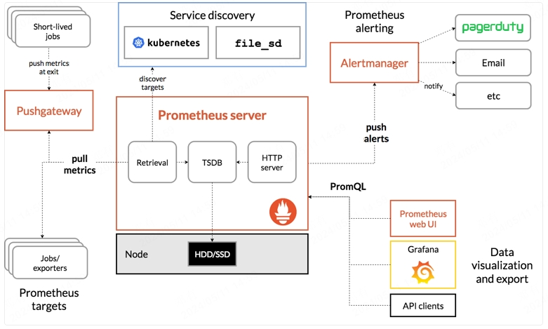

# Kubernetes监控

## Prometheus

### Prometheus简介

Prometheus 是最初在 SoundCloud 上构建的开源系统监视和警报工具包。自2012年成立以来，许多公司和组织都采用了Prometheus，该项目拥有非常活跃的开发人员和用户社区。现在，它是一个独立的开源项目，并且独立于任何公司进行维护。为了强调这一点并阐明项目的治理结构，Prometheus在2016年加入了 Cloud Native Computing Foundation，这是继 Kubernetes 之后的第二个托管项目。

- 多维度模型，使用指标名称和键值对标识时间序列数据
- 灵活的查询语言PromQL,可以李勇数据的多为特性进行查询
- 不依赖分布式存储，单个服务接待你是自治的
- 通过HTTP的拉取模型进行时间序列的推送
- 可以通过中间网关进行时间序列推送
- 可以通过服务发现或静态配置发现监控目标
- 提供多种图形和仪表盘支持

### Prometheus组件

Prometheus 生态系统包含多个组件，其中许多是可选的：

- 用于采集和存取时间序列数据的 [Prometheus server](https://github.com/prometheus/prometheus)

- 用于监测应用的客户端库

- 用于支持短期的作业的 push gateway

- 诸如 HAProxy，StatsD，Graphite 等服务的专用 exporter

- 用于处理告警的 alertmanager

- 多种工具支持

