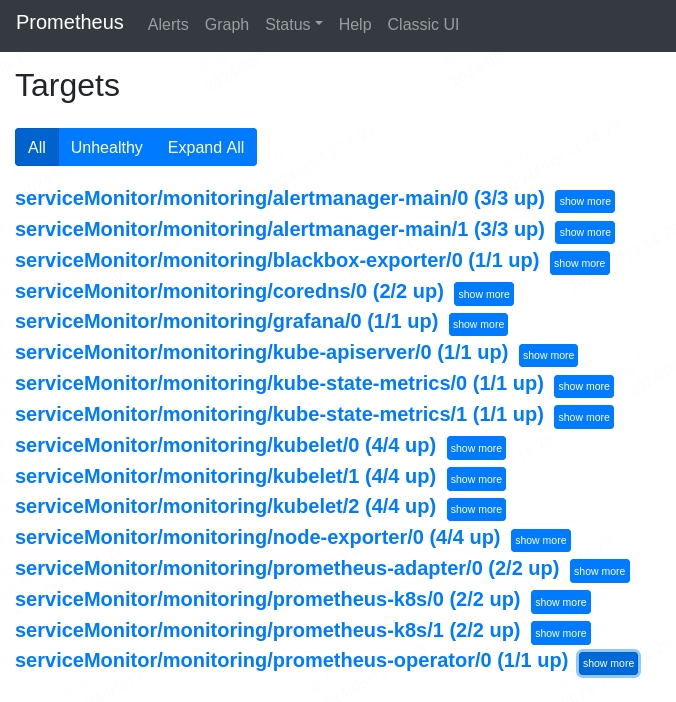
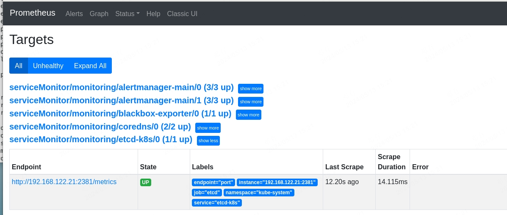
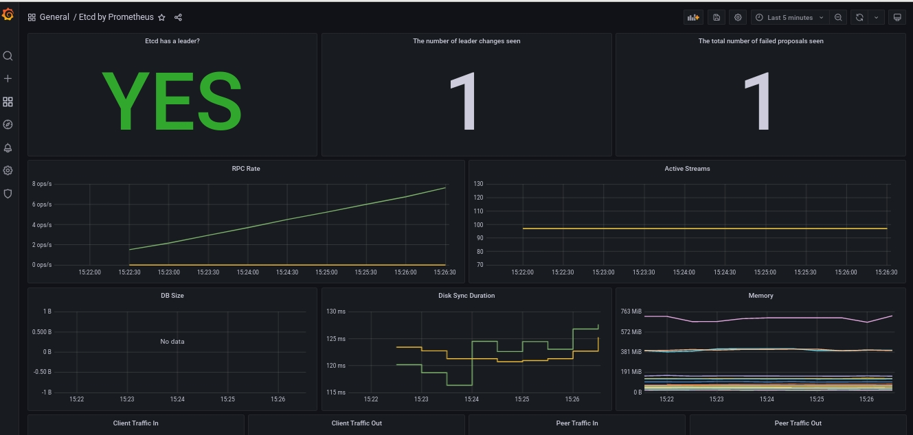

# Kubernetes监控

## Prometheus

### Prometheus简介

Prometheus 是最初在 SoundCloud 上构建的开源系统监视和警报工具包。自2012年成立以来，许多公司和组织都采用了Prometheus，该项目拥有非常活跃的开发人员和用户社区。现在，它是一个独立的开源项目，并且独立于任何公司进行维护。为了强调这一点并阐明项目的治理结构，Prometheus在2016年加入了 Cloud Native Computing Foundation，这是继 Kubernetes 之后的第二个托管项目。

- 多维度模型，使用指标名称和键值对标识时间序列数据
- 灵活的查询语言PromQL,可以李勇数据的多为特性进行查询
- 不依赖分布式存储，单个服务接待你是自治的
- 通过HTTP的拉取模型进行时间序列的推送
- 可以通过中间网关进行时间序列推送
- 可以通过服务发现或静态配置发现监控目标
- 提供多种图形和仪表盘支持


### Prometheus组件

Prometheus 生态系统包含多个组件，其中许多是可选的：

- 用于采集和存取时间序列数据的 [Prometheus server](https://github.com/prometheus/prometheus)

- 用于监测应用的客户端库

- 用于支持短期的作业的 push gateway

- 诸如 HAProxy，StatsD，Graphite 等服务的专用 exporter

- 用于处理告警的 alertmanager

- 多种工具支持


### 安装kube-prometheus-stack

#### 1.获取响应的版本到本地

```shell
v1.22.6]# git clone -b release-0.10 https://github.com/prometheus-operator/kube-prometheus.git
```

#### 2.安装operator
```shell
v1.22.6]# cd kube-prometheus/manifests/setup/
setup]# kubectl  create -f . 
```

#### 3.部署prometheus
```shell
setup]# cd ..
manifests]# sed -i 's@k8s.gcr.io@k8s.dockerproxy.com@g' ./kubeStateMetrics-deployment.yaml ./prometheusAdapter-deployment.yaml

manifests]# kubectl  apply -f .

~]# kubectl  get pod -n monitoring
NAME                                   READY   STATUS    RESTARTS   AGE
alertmanager-main-0                    2/2     Running   0          5m4s
alertmanager-main-1                    2/2     Running   0          5m4s
alertmanager-main-2                    2/2     Running   0          5m4s
blackbox-exporter-6798fb5bb4-jt55b     3/3     Running   0          7m19s
grafana-78d8cfccff-x2l4s               1/1     Running   0          7m15s
kube-state-metrics-7dfd54dccf-t2b9l    3/3     Running   0          7m14s
node-exporter-8dqf2                    2/2     Running   0          7m12s
node-exporter-j59gh                    2/2     Running   0          7m12s
node-exporter-p2nfh                    2/2     Running   0          7m12s
node-exporter-x4tc5                    2/2     Running   0          7m12s
prometheus-adapter-85466d96b5-jj6th    1/1     Running   0          7m1s
prometheus-adapter-85466d96b5-qkfkg    1/1     Running   0          7m1s
prometheus-k8s-0                       2/2     Running   0          5m3s
prometheus-k8s-1                       2/2     Running   0          5m3s
prometheus-operator-7ddc6877d5-4j6jg   2/2     Running   0          6m57s
```

#### 4.暴露grafana和promehtuesUI

- 默认密码为：admin/admin

```shell
~]# kubectl  patch svc grafana -p '{"spec": {"type": "NodePort"}}' -n monitoring
~]# kubectl  patch svc prometheus-k8s -p '{"spec": {"type": "NodePort"}}' -n monitoring      
~]# kubectl  get svc prometheus-k8s grafana -n monitoring 
NAME             TYPE       CLUSTER-IP       EXTERNAL-IP   PORT(S)                         AGE
prometheus-k8s   NodePort   10.111.189.171   <none>        9090:32324/TCP,8080:31925/TCP   9m49s
grafana          NodePort   10.109.174.142   <none>        3000:32279/TCP                  9m59s
```


### 自定义监控告警

除 Kubernetes 集群中的一些资源对象、节点以及组件需要监控，有的时候我们可能还需要根据实际的业务需求去添加自定义的监控项，添加一个自定义监控的步骤如下：
- 1.建立一个ServiceMonitor对象，用于添加监控项
- 2.为ServiceMonitor对象关联metrics数据接口的一个 Service 对象
- 3.确保 Service 对象可以正确获取到 metrics 数据

#### 1.云原生应用etcd

1.修改etcd metrics数据接口主机IP
```yaml
~]# vim /etc/kubernetes/manifests/etcd.yaml
...
spec:
  containers:
  - command:
    - etcd
    - --advertise-client-urls=https://192.168.122.21:2379
    - --cert-file=/etc/kubernetes/pki/etcd/server.crt
    - --client-cert-auth=true
    - --data-dir=/var/lib/etcd
    - --initial-advertise-peer-urls=https://192.168.122.21:2380
    - --initial-cluster=k8s-master-01=https://192.168.122.21:2380
    - --key-file=/etc/kubernetes/pki/etcd/server.key
    - --listen-client-urls=https://127.0.0.1:2379,https://192.168.122.21:2379
    - --listen-metrics-urls=http://192.168.122.21:2381 # 修改这里
    - --listen-peer-urls=https://192.168.122.21:2380
    - --name=k8s-master-01
    - --peer-cert-file=/etc/kubernetes/pki/etcd/peer.crt
    - --peer-client-cert-auth=true
    - --peer-key-file=/etc/kubernetes/pki/etcd/peer.key
    - --peer-trusted-ca-file=/etc/kubernetes/pki/etcd/ca.crt
    - --snapshot-count=10000
    - --trusted-ca-file=/etc/kubernetes/pki/etcd/ca.crt
```
2.创建ServiceMonitor对象
```yaml
manifests]# cat kubernetesControlPlane-serviceMonitorEtcd.yaml
---
apiVersion: monitoring.coreos.com/v1
kind: ServiceMonitor
metadata:
   name: etcd-k8s
   namespace: monitoring
   labels:
     k8s-app: etcd-k8s
spec:
  jobLabel: k8s-app
  endpoints:
    - port: port
      interval: 15s
  selector:
    matchLabels:
      k8s-app: etcd
  namespaceSelector:
    matchNames:
      - kube-system
```

3.创建Serive对象来关联ServiceMonitor
```yaml
manifests]# cat etcd-service.yaml 
apiVersion: v1
kind: Service
metadata:
  name: etcd-k8s
  namespace: kube-system
  labels:
    k8s-app: etcd
spec:
  type: ClusterIP
  clusterIP: None # 一定要设置 clusterIP:None
  ports:
    - name: port
      port: 2381
---
apiVersion: v1
kind: Endpoints
metadata:
  name: etcd-k8s
  namespace: kube-system
  labels:
    k8s-app: etcd
subsets:
  - addresses:
      - ip: 192.168.122.21 # 指定etcd节点地址，如果是集群则继续向下添加
        nodeName: k8s-master-01
    ports:
      - name: port
        port: 2381

manifests]# kubectl  apply -f etcd-service.yaml 
```


4.导入图表

数据采集到后，可以在 grafana 中导入编号为 3070 的 dashboard，就可以获取到 etcd 的监控图表




